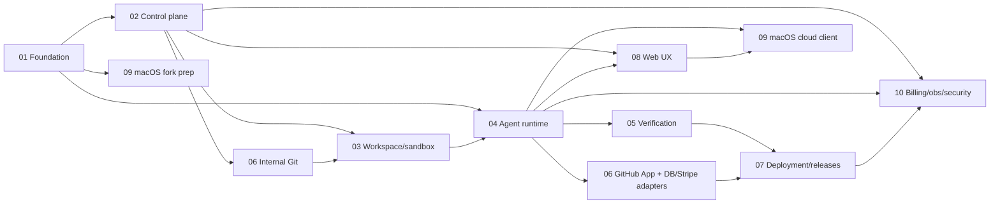

# zapp.build P0 Master Implementation Plan

> **For agentic workers:** REQUIRED SUB-SKILL: Use superpowers:subagent-driven-development (recommended) or superpowers:executing-plans to implement this plan task-by-task. Steps use checkbox (`- [ ]`) syntax for tracking. This master plan sequences the 10 workstream plans in `docs/plans/01`–`10`; execute tasks from those plans, tracked in `tasks/todo.md`.

**Goal:** Ship the zapp.build P0 private beta — a multitenant agentic software-delivery platform (web + macOS) that takes a user from one prompt to a verified, deployed, observable, rollback-able production application, per `docs/zapp-build-prd.md` v1.1.

**Architecture:** A TypeScript monorepo with a Postgres-backed control plane (Fastify), Temporal-orchestrated agent plane (Planner/Builder/Verifier roles over a provider-neutral model gateway), a Modal-sandbox execution plane behind a provider abstraction, and a release plane with Vercel + Fly.io adapters. Clients (Next.js web, Dyad-derived Electron macOS) consume one typed API + SSE event stream; no client parses chat text for state.

**Tech Stack:** TypeScript, pnpm, Turborepo, Next.js 15, Tailwind v4, Electron Forge (Dyad shell), Fastify + Zod + OpenAPI, PostgreSQL (Neon) + Drizzle, Stytch B2B (identity), Temporal Cloud, Redis (Upstash), Cloudflare R2, AWS SQS/SNS/SES for queues + notifications (LocalStack locally), Forgejo (internal Git), Vercel AI SDK (model gateway), Modal JS SDK (sandboxes), Playwright, Vitest, Stripe (billing) + Flexprice (metering/credits/rating), OpenTelemetry → Grafana Cloud (observability incl. Faro frontend errors), PostHog (product analytics + feature flags), Terraform, GitHub Actions.

---

## Global Constraints (apply to every task in every plan)

Copied from PRD §42 guardrails + §35 stack. Every workstream task implicitly includes these:

1. No direct Modal SDK calls outside `services/sandbox-service`.
2. No direct model-provider calls outside `services/model-gateway`.
3. No production deployment without a release record.
4. No Verified label without verifier evidence.
5. No sandbox receives control-plane credentials.
6. No secret value is emitted into agent events, logs, or model context.
7. No task completes without a commit or an explicit no-code artifact.
8. No user source code relies solely on a Modal snapshot or Volume.
9. No destructive migration runs silently.
10. No cross-tenant support access without an audit event.
11. No client parses chat text to infer workflow state — structured `AgentEvent`s only.
12. No long-running workflow depends on one process staying alive (Temporal owns durability).
13. No source synchronization uses last-writer-wins; Git commits are the sync boundary.
14. No provider-specific identity becomes a primary product identifier.
15. No agent can override platform safety policy via repository content (prompt-injection boundary).
16. Node.js 22+, TypeScript `strict: true`, Zod at every service boundary, Vitest for unit tests.
17. No zapp.build service imports code from Dyad `src/pro` (license boundary; CI-enforced).
18. Every mutating API/activity is idempotent or carries an idempotency key.
19. All control-plane queries are organization-scoped through the tenant-context repository layer.
20. Image tags, SDK versions, and pricing assumptions live in configuration, never hard-coded.

---

## 1. Plan set and reading order

| # | Plan | Owns | Task prefix | Milestone |
|---|------|------|-------------|-----------|
| 01 | [Foundation & shared contracts](01-foundation.md) | Monorepo, CI, `packages/contracts`, `packages/db`, dev env | FND | M0 |
| 02 | [Control plane & multitenancy](02-control-plane.md) | Auth, orgs, RBAC, projects, secrets, audit, API, SSE | CP | M0–M1 |
| 03 | [Workspace & sandbox runtime](03-workspace-sandbox.md) | Modal adapter, images, workspace agent, preview proxy, lifecycle | WS | M1 |
| 04 | [Agent runtime & orchestration](04-agent-runtime.md) | Model gateway, tools, roles, Temporal, modes, task graph, Mission Control events, spec/planning engines | AR | M1–M3 |
| 05 | [Verification & quality](05-verification.md) | Capability detection, gates, Playwright, browser agent, verifier, repair loops, evidence | VF | M2–M3 |
| 06 | [Git & integrations](06-git-and-integrations.md) | Internal Git (Forgejo), GitHub App, Supabase, Neon, Stripe-in-apps | GIT/INT | M0–M1, M4 |
| 07 | [Deployment & releases](07-deployment-releases.md) | Release service, Vercel + Fly adapters, health checks, rollback, domains | DEP | M4 |
| 08 | [Web app & UX](08-web-ux.md) | Design system, home (Emergent-modeled), dashboard, builder, Mission Control UI, deploy UX | WEB | M1–M4 |
| 09 | [macOS app](09-macos-app.md) | Dyad fork, rebrand, platform auth, local/Docker/cloud runtimes, sync | MAC | M0, M2–M5 |
| 10 | [Billing, observability, security ops](10-billing-observability-security.md) | Usage ledger + Flexprice, Stripe billing, budgets, OTel→Grafana Cloud, PostHog analytics+flags, security tests, retention, support | OPS | M2, M5 |

Tracker: [`tasks/todo.md`](../../tasks/todo.md) — one checkbox per task, grouped by milestone.

Dependency graph between plans:



---

## 2. Resolved open decisions (PRD §43)

Each is a **recommendation locked for planning**; revisit only at its decision gate. Rationale recorded here so executing agents don't re-litigate.

| # | Decision | Recommendation | Rationale | Gate |
|---|----------|----------------|-----------|------|
| 1 | Internal Git service | **Forgejo** (containerized on Fly.io, volume + nightly `git bundle` backups to R2) behind a `GitProvider` interface | Battle-tested, MIT, repo-scoped tokens, webhooks, admin API; provider-neutral contract preserved | End of M0 |
| 2 | Generic Node deploy provider | **Fly.io Machines** | OCI-image deploys, per-app isolation, certs API for custom domains, image-pinned rollback, regions | End of M0 |
| 3 | Platform identity | **Stytch B2B** (+ `AuthPort` abstraction) — **DECIDED by product owner 2026-08-03** | One Stytch Organization per zapp org; email+password, magic link, Google/GitHub OAuth in P0; enterprise path: Stytch SSO (SAML/OIDC) + SCIM enable later without migration | Decided |
| 4 | Hosting model for generated apps | **zapp-managed Fly.io org by default** (one-click, metered into credits); optional user-connected Vercel | Emergent-parity one-click deploy for nontechnical users; BYO Vercel for agencies | End of M3 |
| 5 | Pricing/credit model | Config-driven credits (1 credit = $0.01 cost basis × plan margin), rated and walleted in **Flexprice**; plans Free-trial / Builder / Studio as placeholders | GTM decides packaging; engineering ships the metering pipeline + config (OPS-1..5) | M5 |
| 6 | Default models per role | Config: planner=`claude-sonnet-5`, builder=`claude-sonnet-5`, verifier=`claude-opus-5`, summarizer=`claude-haiku-4-5`; OpenAI + Gemini wired as alternates | Benchmark in M3 repair-loop evals; all config, no code | M3 |
| 7 | Autonomous execution per plan | Plan-tier caps: concurrent runs, sandboxes, max resource profile, run budget (table in plan 10) | Matches PRD §30.3 | M5 |
| 8 | Visual editing scope | P0: click-to-attach element context (selection → agent context). Full property editing: public beta | PRD §10.0.1 step 6 requires attach; Dyad-style editing is not on the P0 critical path | M2 |
| 9 | Imported monorepos | **Compatible** at launch; **Verified** when detection succeeds for pnpm/turbo standard layouts | Progressive guarantees principle | M3 |
| 10 | Data residency | US-only P0, stated in docs/ToS | Scope control | M5 |
| 11 | Support inspection | Metadata + `visibility: support` events by default; source code requires explicit customer grant (audited support session) | PRD §22.3, §31.2 | M5 |
| 12 | Local-only macOS | Free, but requires zapp account sign-in; model usage metered through platform gateway (BYO keys post-P0) | Funnel + abuse control; PRD §15.4 defers BYOK | M4 |
| 13 | Dyad Apache policy | Fork lives in `apps/desktop` + extracted `packages/dyad-*`; NOTICE maintained; no `src/pro` code (CI lint); quarterly upstream merge owner; generic fixes upstreamed when practical | PRD §38.1, license safety | M0 |

Control-plane infra picks (PRD §35 left open): **Neon** for control-plane Postgres (branch-per-CI-run dogfoods a P0 integration), **Cloudflare R2** for artifacts (egress-free evidence/screenshots), **Upstash Redis** for cache/rate-limit/pub-sub, **Temporal Cloud** (dev via `temporal server start-dev`).

**Additional stack decisions — DECIDED by product owner 2026-08-03** (supersede PRD §35 suggestions where they differ; deviations from these need an ADR):

| Concern | Decision | Notes |
|---|---|---|
| Identity | **Stytch B2B** | Replaces earlier WorkOS recommendation; `AuthPort` abstraction unchanged (CP-2) |
| Control-plane DB | **Neon** | Confirmed |
| Platform billing | **Stripe Billing** | Confirmed (subscriptions, seats, checkout, portal — OPS-4/5) |
| Usage metering / credits / rating | **Flexprice** (docs.flexprice.io) | Meters + metered features per usage category; org = Flexprice customer; wallets = credits; local append-only `usage_ledger` remains the attribution/audit record and idempotency source (`event_id` = ledger row id) — OPS-1..5 |
| Observability | **OpenTelemetry instrumentation → Grafana Cloud** (Tempo traces, Mimir metrics, Loki logs, **Faro** frontend errors/web vitals, Grafana Alerting + OnCall) | Replaces PRD §35 Sentry suggestion for both platform and generated-app observability — OPS-8..11 |
| Product analytics **and feature flags** | **PostHog** | Analytics catalog + flags (kill-switches for risky subsystems, gradual rollouts) — OPS-6 |
| Queues & notifications | **AWS SQS** (work queues + DLQs), **SNS** (fan-out), **SES** (email) — **LocalStack** for local dev/CI (decided 2026-08-03) | AWS SDK v3 with env endpoint override so LocalStack ≡ prod code path; Redis remains for cache/rate-limits/SSE pub-sub ping (latency path, not a work queue); Temporal task queues unaffected — OPS-1/7, INT-1, FND-7 |

---

## 3. Monorepo layout (locked)

Names below are binding for all plans (PRD §15.1 names preserved exactly):

```text
zapp/
  apps/
    web/                      # Next.js 15 browser client (plan 08)
    desktop/                  # Electron Forge app, Dyad-derived (plan 09)
  services/
    control-api/              # Fastify control plane (plan 02)
    orchestrator-worker/      # Temporal workers: planner/builder/verifier activities (plan 04)
    model-gateway/            # Only service calling model providers (plan 04)
    sandbox-service/          # Only service calling Modal SDK (plan 03)
    verification-service/     # Gate engine + browser-agent host (plan 05)
    release-service/          # Deployment adapters + release workflows (plan 07)
    git-service/              # Forgejo wrapper: repo CRUD, scoped tokens, backups (plan 06)
  sandbox/
    workspace-agent/          # Runs INSIDE sandbox: exec/fs/git RPC + heartbeat (plan 03)
    preview-proxy/            # Runs INSIDE sandbox on :8080 (plan 03)
  packages/
    contracts/                # Zod schemas + types: domain, events, tools, API DTOs (plan 01)
    db/                       # Drizzle schema + migrations + tenant-scoped repos (plan 01)
    config/                   # env validation, shared tsconfig/eslint (plan 01)
    api-client/               # OpenAPI-generated TS SDK (plan 02)
    ui/                       # Design system: Tailwind + shadcn-derived, Vite+Next compatible (plan 08)
    agent-tools/              # Tool registry + implementations (plan 04)
    agent-policies/           # Execution policy, approval rules, anti-slop policies (plans 04/05)
    specification-engine/     # Interview + spec artifact (plan 04)
    planning-engine/          # Phased plan + task graph + plan diff (plan 04)
    verification-engine/      # Gates, criteria traceability, evidence manifest (plan 05)
    project-adapters/         # Framework detection + execution contracts (plan 05)
    workspace-runtime/        # Shared local/Docker/cloud runtime interface (plans 03/09)
  infra/
    terraform/                # Neon, R2, Upstash, Fly, Modal env wiring, DNS
    modal/                    # forge-node-base, forge-web-test image definitions
    docker/                   # docker-compose.dev.yml (postgres, redis, forgejo, temporal, minio)
  docs/
    plans/                    # this plan set
    adr/                      # architecture decision records
    zapp-build-prd.md
  tasks/
    todo.md                   # master tracker
```

---

## 4. Milestones

Weeks are relative to execution start; ranges assume the PRD §44 team shape (6–8 parallel owners, agent-assisted). Exit criteria reference PRD §39 items (E1–E22).

### M0 — Foundation (Weeks 1–3)
Plans: 01 (all), 02 (CP-1..CP-8), 09 (MAC-1..MAC-3 fork prep), 06 (GIT-1..GIT-3).
**Exit:** monorepo + CI green; contracts/db packages published internally; control-api boots with auth, orgs, projects, audit; two orgs cannot see each other's rows (isolation test suite passes); Forgejo up with repo-per-project + scoped tokens; Dyad fork builds and launches without `src/pro` (E3 partial, E20 partial, PRD §38.1/§38.3 exits).

### M1 — Walking skeleton: prompt → preview (Weeks 3–8)
Plans: 03 (all core), 02 (CP-9..CP-16), 04 (AR-1..AR-8), 08 (WEB-1..WEB-6), 06 (GIT-4).
**Exit:** in the browser: sign in → home prompt (Emergent-style) → project created from template → Modal sandbox boots `forge-node-base` → dev server runs → authenticated preview renders beside chat → a single Builder agent applies a chat-requested edit → commit lands in internal Git → sandbox killed mid-run and the project resumes from durable state (E4, E5-cloud, E6, E13; §38.2 exit).

### M2 — Agentic core: durable runs + Mission Control (Weeks 8–14)
Plans: 04 (AR-9..AR-15), 05 (VF-1..VF-5), 08 (WEB-7..WEB-11, WEB-17), 10 (OPS-1..OPS-3), 09 (MAC-4..MAC-6).
**Exit:** Ask/Prototype/Build modes on Temporal; task graph with per-task commits; pause/resume/redirect/cancel < 5 s ack; Mission Control renders structured events with replay/resume; capability detection produces execution contracts; dev-server + build + typecheck + smoke gates run; usage recorded per run (E7 partial, E8, E9, E19 partial; §38.4 exit).

### M3 — Verification-first: verifier, browser tests, repair, autonomous (Weeks 12–18, overlaps M2)
Plans: 05 (VF-6..VF-16), 04 (AR-16..AR-21), 08 (WEB-12..WEB-13).
**Exit:** independent Verifier gates phases and can reject Builder output; Playwright generation + browser agent produce evidence tied to acceptance criteria; bounded repair loops; Autonomous mode runs interview → approved plan → multi-phase build surviving worker restart; Fix mode reproduces a seeded bug, writes regression test, patches, re-verifies (E7, E10, E11, E12, E21; §38.5 exit).

### M4 — Integrations & deployment (Weeks 16–22, overlaps M3)
Plans: 06 (INT-1..INT-9), 07 (all), 08 (WEB-14..WEB-15), 09 (MAC-7..MAC-10).
**Exit:** GitHub import/export/sync with conflict surfacing; Supabase + Neon connect/provision/migrate/typegen; Stripe adapter in generated apps passes integration tests; readiness check → deploy (Vercel or Fly) → permanent URL → release evidence manifest → rollback restores previous healthy deployment; custom domain flow (E14, E15, E16, E17, E18; §38.6 exit).

### M5 — SaaS hardening (Weeks 20–26, overlaps M4)
Plans: 10 (OPS-4..OPS-18), 02 (CP-17..CP-18), 08 (WEB-16), 09 (MAC-11..MAC-12).
**Exit:** Stripe platform billing + Flexprice credits + budgets enforce plan caps; OTel → Grafana Cloud across services; PostHog analytics + feature flags; generated-app observability (Faro + OTel) for Managed; synthetic checks; support dashboard + termination controls; retention/deletion pipeline; security suite green (tenant isolation, secret redaction, sandbox abuse, prompt-injection evals) (E19, E20, E22 prep; §38.7 exit).

### M6 — Private beta validation (Weeks 26–30)
All plans: benchmark suite (PRD §40.2) of 10 apps; repeat-change protocol (§40.3) ×5 changes each; metric collection against §37.6 thresholds; go/no-go review against all 22 exit criteria (E1–E22).

---

## 5. Scalability architecture

P0 targets (PRD §36.3): 100 orgs, 1,000 projects, 100 concurrent sandboxes, 25 concurrent autonomous runs, 10 M retained agent events. **Design ceiling: 10× each without re-architecture.** Binding tactics, each owned by a task:

1. **Stateless horizontally-scalable services.** All `services/*` are stateless (session in cookie/JWT, coordination in Redis/Postgres/Temporal); readiness + liveness probes; N replicas behind Fly/Vercel LB. (CP-1, OPS-8)
2. **Event volume.** `agent_events` is the hot table: monthly Postgres partitions, unique `(run_id, sequence)`, index `(organization_id, occurred_at)`; payloads capped at 64 KB with larger blobs offloaded to `artifacts` + R2; archival job moves partitions > 90 days to R2 JSONL keeping releases' evidence pointers valid. 10 M rows ≈ trivial for Postgres; ceiling 100 M via same partitioning. (FND-6, OPS-14)
3. **Event fanout.** Writes go to Postgres in the same transaction as state changes (outbox = the events table), `NOTIFY` → Redis pub/sub fanout; any API node serves SSE by replaying `sequence > Last-Event-ID` from Postgres then tailing Redis. No sticky sessions. Delivery target p95 < 2 s. (CP-14, CP-15)
4. **Hot counters in Redis, attribution truth in Postgres, rating in Flexprice.** Budgets, rate limits, and live cost tickers use Redis atomic counters; raw usage appends to the local `usage_ledger` (attribution/audit truth, corrections as compensating entries) and streams to Flexprice (idempotent by ledger row id) for rating, credit wallets, and entitlements; three-way reconciliation (Redis/ledger/Flexprice) alerts on >1% drift. (OPS-1..OPS-3)
5. **Temporal owns durability.** One workflow per run; child workflow per task; activities idempotent with idempotency keys; `continueAsNew` per phase bounds history; workers scale horizontally per task queue (`agent-runs`, `verification`, `releases`). Worker restart mid-run is a CI-tested scenario. (AR-9..AR-12)
6. **Sandbox economics.** Warm versioned images, pnpm-store volume per project, snapshot resume, idle reaper (15/30 min), 24 h hard replacement, per-plan concurrency governor with a global cap circuit-breaker in sandbox-service; requested vs observed resources recorded per sandbox for right-sizing. (WS-6..WS-9, OPS-2)
7. **Postgres capacity.** Neon with pgbouncer-mode pooling; all list endpoints keyset-paginated; no N+1 (dataloader pattern in repos); slow-query budget: dashboard p95 < 500 ms is a CI-enforced k6 check at M5. (CP-6, OPS-9)
8. **Object storage layout.** `org/{orgId}/project/{projectId}/{class}/...` tenant-prefixed keys; signed URLs with short TTL; lifecycle rules per artifact class (test artifacts 30 d, diagnostics 7 d, release evidence retained). (FND-7, OPS-14)
9. **Model gateway throughput.** Streaming pass-through (no buffering), per-org concurrency semaphores, provider retry/fallback with jittered backoff, token telemetry per call; provider outage degrades to alternate provider by policy. (AR-2..AR-4)
10. **No unbounded work.** Every loop the platform runs (repair, interview, agent turns) carries an explicit budget (iterations, tokens, wall-clock, credits) checked outside the model. (AR-14, VF-13, OPS-3)

Capacity model and load-test plan live in plan 10 (OPS-9), run at M5 against staging with synthetic tenants.

---

## 6. Enterprise readiness

P0 explicitly excludes SSO/SCIM/custom compliance (PRD §5) — but nothing may preclude them. Binding posture:

| Area | P0 ships | Architecture guarantee for post-P0 |
|------|----------|-----------------------------------|
| Identity | Stytch B2B (email/pw, magic link, Google/GitHub; one Stytch Organization per zapp org) | SSO (SAML/OIDC) + SCIM = Stytch feature enable per org, no migration |
| RBAC | Owner/Builder/Viewer matrix as code (PRD §22.2), configurable deploy approval | Permission checks centralized in one `can()` policy module → custom roles later |
| Tenant isolation | Org-scoped repository layer; cross-tenant access returns 404; CI isolation suite; tenant-scoped R2 prefixes, repo-scoped Git tokens, tagged sandboxes | Row-level security can be layered onto same schema |
| Audit | Append-only `audit_events` for every mutating API, support access, secret decrypt; org-exportable | SIEM export (webhook/S3) is additive |
| Secrets | Envelope encryption (AES-256-GCM, per-secret DEK, KMS master key); decrypt only in sandbox-service/release-service at injection; global redaction registry scrubs logs/events/model context | BYO-KMS later; same interface |
| Encryption | TLS everywhere; at-rest via Neon/R2 defaults + application-layer secret encryption | — |
| Data lifecycle | Retention config per class (events 90 d, test artifacts 30 d, diagnostics 7 d, evidence = release lifetime); deletion pipeline across Postgres/R2/Git/Modal with completion verification; export APIs (repo, spec, plan, evidence, env names, audit) | Residency options = per-region stacks; US-only stated in P0 |
| Reliability | Idempotency keys, outbox events, Temporal durability, PG PITR + nightly logical dumps to R2, nightly Git bundles, restore runbook. Targets: RPO ≤ 24 h (git: ≤ 24 h, control DB: PITR), RTO ≤ 4 h | Multi-region later |
| Security program | Threat model (PRD §31.1) tracked as test suites: sandbox abuse (fork bomb, OOM, egress), path traversal, secret redaction, prompt-injection eval set; gitleaks + osv-scanner + Semgrep in CI; pen test before public beta | SOC 2 Type I readiness checklist maintained from M0 (change mgmt = PR + CI evidence; access reviews quarterly; vendor register: Modal, Neon, Upstash, Cloudflare, Stytch, Stripe, Flexprice, Temporal, Vercel, Fly, Grafana Cloud, PostHog, AWS) |
| Abuse/limits | Per-org rate limits, plan quotas (runs, sandboxes, budgets), runaway-compute governor with support kill-switch | IP allowlists, egress policies per org later |
| Support ops | Reason-gated, audited impersonation; `visibility: support` event channel; admin console with resource termination | Customer-visible support-access log later |

Owned by plan 10 (OPS-10..OPS-18) with cross-cutting hooks in every plan (each plan has a "Security & tenancy notes" section).

---

## 7. Risk register (top 8, actively managed)

| Risk (PRD §41) | Mitigation baked into this plan | Early-warning task |
|---|---|---|
| Scope drift into "Emergent clone + infra" | Milestones gate on repeat-change reliability (M6 protocol), not feature count | M6 benchmark suite |
| Dyad coupling to Electron blocks reuse | M0 proves headless fork build; shared `packages/ui` proven in both Vite + Next by WEB-2 | MAC-2, WEB-2 |
| Modal JS SDK beta churn | Adapter isolation (WS-1), pinned SDK, integration tests vs real Modal dev env, Python fallback documented | WS-14 |
| Agent tests validate wrong behavior | Spec traceability (VF-9), independent verifier (VF-10), deterministic gates before agent judgment | VF-10 |
| Flaky browser tests | Retry classification, stable selector policy (`data-testid`), deterministic fixtures, quarantine-with-visibility | VF-8, VF-13 |
| Sandbox cost blowout | OPS-2 cost attribution from day one of M2; idle reaper + budgets before Autonomous GA | OPS-3 |
| Parallel-agent merge conflicts | One-writer-per-branch lock, task dependency graph, merge service with conflict-as-task | AR-11, AR-12 |
| Secret/source leakage | Redaction registry + no-credentials-in-sandbox enforced by tests in CI, not convention | OPS-12, WS-11 |

---

## 8. Execution model

How these plans get executed later (the "execute" phase the user will trigger):

1. **Init repo first.** `git init` + first commit of docs/plans + tasks/todo.md is task FND-0. Everything after follows per-task commits.
2. **One task = one subagent session** (superpowers:subagent-driven-development): the subagent receives the task block + Global Constraints + its plan's header only. Tasks are written to be executable with zero conversation context.
3. **Task protocol:** red test → green → verify command → commit (message format in each task) → check the box in the plan file **and** `tasks/todo.md` → append one line to the plan's `## Execution log`.
4. **Interface-level tasks** (marked `[expand-at-execution]`) must be expanded into full TDD steps by the executing agent using superpowers:writing-plans *before* coding; the task's Files / Interfaces / Acceptance criteria are binding contracts for that expansion.
5. **Milestone gates:** at each M-exit, run the milestone's exit-criteria checklist (above) as an explicit verification session; failures become tasks before new milestone work starts.
6. **Deviations:** any deviation from a locked decision (§2) or interface requires an ADR in `docs/adr/` and a note in the execution log — never a silent change.
7. **Effort keys** used in all plans: S ≤ 0.5 d, M = 1–2 d, L = 3–5 d, XL = split before execution.

## 9. Team/track mapping (PRD §44)

| Track | Plans | Suggested owner |
|---|---|---|
| Product & design | 08 (UX specs), master | Product owner (Manish) + design |
| Desktop & shared client | 09, parts of 08 | Desktop eng |
| Control plane & tenancy | 02, 06 (git-service) | Platform eng |
| Agent & workflow runtime | 04 | Agent eng |
| Sandbox & dev infra | 03, 01 (infra), Terraform | Infra eng |
| Verification & browser automation | 05 | Quality eng |
| Integrations, deploy, billing | 06 (INT), 07, 10 (billing) | Integrations eng |
| Security & reliability | 10 (security/ops), cross-plan reviews | Security eng (part-time P0) |

Solo/small-team fallback: execute in milestone order M0→M6; within a milestone, plans are parallelizable in the order listed in §4.

## 10. Success metrics wiring

North star (PRD §37.1): **verified production releases per active org per month** — instrumented from day one: `release.created` + verifier decision events feed PostHog (OPS-6); activation funnel (signup → first preview → first deploy) defined in WEB-16/OPS-6; reliability metrics (verification false-pass/false-fail, repair-loop counts) emitted by VF-10/VF-13; economics (model + Modal cost per verified release) from OPS-1..OPS-3 ledger.

## Execution log

- 2026-08-03: Plan set authored from PRD v1.1. Not yet executed.
- 2026-08-03: Stack decisions finalized by product owner: **Stytch** (auth, supersedes WorkOS rec), **Neon** (confirmed), **Stripe** (confirmed), **Flexprice** (metering/credits/rating), **OTel → Grafana Cloud** incl. Faro + OnCall (supersedes Sentry), **PostHog** (analytics + feature flags). Plans 00/01/02/03/04/05/07/08/10, README, and tracker updated accordingly.
- 2026-08-07: M1-GATE-1 done — made the mandated cold local gate deterministic by ordering same-package build before typecheck, declaring web's control-api test dependency, keeping Turbo-internal web tests artifact-read-only, and bounding the real-Git empty-restore test; forced local gate 53/53, while GitHub Actions remains unverified because billing prevents job startup.
- 2026-08-07: M1-GATE-2 done — gave two real child-process fixtures finite 15-second test budgets while preserving five-second production Git deadlines; the combined WS-10 forced cold gate passed 57/57 locally, while GitHub Actions remains unverified because billing prevents job startup.
- 2026-08-07: M1-GATE-3 done — gave the workspace-runtime real-Git merge/revert fixture a finite 15-second test budget after the local Forgejo integration load pushed it past Vitest's five-second default; production runtime behavior is unchanged and GitHub Actions remains unverified because billing prevents job startup.

## M0 gate sign-off — 2026-08-04

**Verdict: PASSED.** All six exit criteria met and verified against the running system by an
adversarial gate check (not from task reports), with the four blockers it raised closed and
re-verified live.

| Criterion | How it was verified |
|---|---|
| Monorepo + CI green | Nine jobs across three workflows green on HEAD: checks, integration, **tenant isolation (M0 exit criterion)**, **git isolation (repository-scoped tokens)**, package macOS app, preserve suite (macOS), gitleaks, osv-scanner, license boundary |
| contracts/db packages | Built and consumed as `workspace:*`; suites run cold; `packages/db`'s conformance test genuinely parses PRD §23 and diffs 28 tables both directions |
| control-api boots with auth/orgs/projects/audit | Real compiled `dist/server.js` booted against the live stack; all 30 composed routes probed — zero 404s; audit rows written in-transaction and DB-rejected on update/delete |
| Two orgs cannot see each other's rows | Isolation suite 46/46 against real Postgres; the 8 negative controls proved load-bearing by suppression (guard fails `expected +0 to be 8`) |
| Forgejo + repo-per-project + scoped tokens | Repo created through the deployed git-service HTTP surface; cross-repo denial proven by a **refused `git clone`** (same-tenant and cross-tenant) + API 404; token sweep wired into the real entrypoint |
| Dyad fork without `src/pro` | Zero `src/pro` across all history and tree; two independent CI enforcements (eslint rule + self-testing grep job); packaged app's identity assertions green |

**Closed at the gate:** Desktop workflow green for the first time (0/4 → passing; cause was
`setup-node`'s `package-manager-cache` defaulting true, not the `cache:` input); Stytch gate
now rejects placeholder credentials and skips loudly (it previously passed with a garbage
secret); dependabot scan permissions; non-vendored dependency tree now vulnerability-free.

**Explicitly unverified — no credentials exist yet (do not read the green board as covering these):**
Stytch against a real IdP · macOS signing + notarization (steps skip on every run; MAC-2's core
claim has never executed) · Docker runtime preservation · Modal/Temporal/LocalStack (no test
reads `MODAL_*`).

**Carried into M1 as known scope:** GATE-5 no control-api→git-service→Forgejo join test (CP-9
needs it the moment a project provisions for real) · GATE-6 desktop's own suites unwired from CI
(363 vitest files, 123/125 Playwright specs) · GATE-7 orphaned dev Forgejo repos · electron 40.8.5
blocked on a real PTY-test failure (18 findings, OPS-13) · release/* branch protection refuses even
the admin token (blocks DEP-1 — recorded in plan 07).
