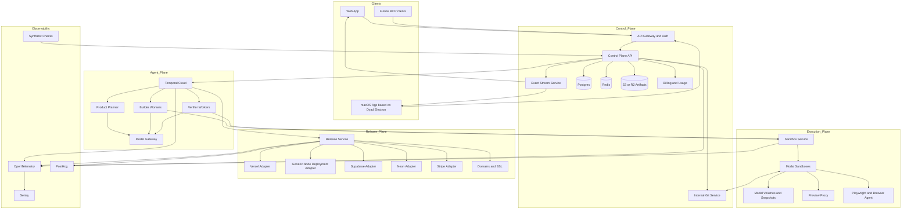
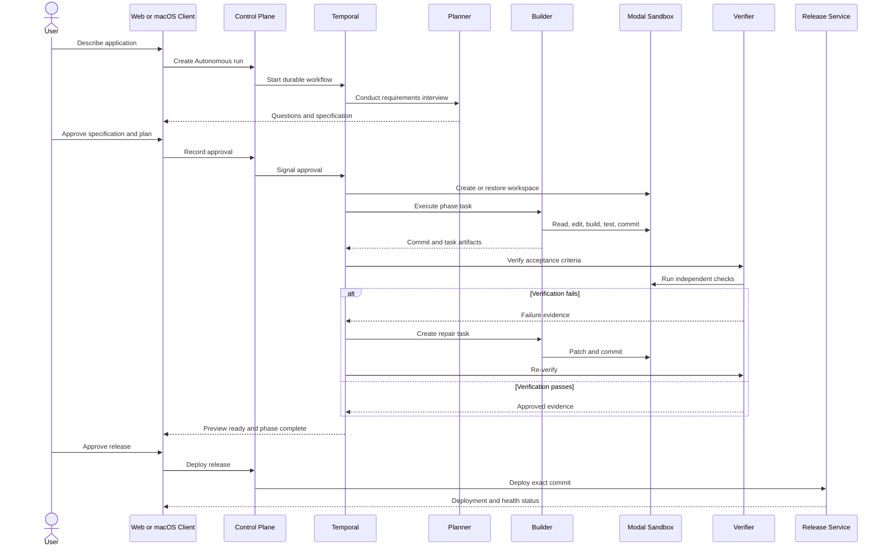

# zapp.build Product Requirements Document

**Product name:** zapp.build  
**Status:** Draft for engineering and design review  
**Version:** 1.1  
**Date:** 2026-08-03  
**Product owner:** Manish  
**Target release:** P0 private beta  
**Foundation:** Apache 2.0 licensed Dyad code outside `src/pro`, with a separately designed proprietary cloud control plane, agent runtime, verification system, and release platform  

---

## 1. Executive summary

zapp.build is a multitenant agentic software development platform for building, testing, deploying, and operating production applications.

The product combines:

1. **Dyad-class flexibility:** Support every JavaScript or TypeScript project that Dyad can create, import, run, and edit.
2. **Emergent-class autonomy:** Requirements interviews, approved phased plans, long-running builds, Mission Control, subagents, automatic testing, repair loops, previews, and one-click deployment.
3. **Verification-first delivery:** An independent verifier, executable acceptance criteria, regression tests, release evidence, observability, and rollback.
4. **Local and cloud workflows:** A browser application for cloud-first collaboration and a macOS application based on the Dyad Electron shell for local, Docker, and cloud workflows.
5. **Managed SaaS primitives:** Supabase, Neon, Stripe, GitHub, deployment providers, secrets, environments, custom domains, monitoring, and product analytics.

The core promise is:

> Build any Dyad-compatible JavaScript or TypeScript application, then progressively harden it into a verified and managed production release.

The product must not promise that regressions are impossible. It must promise that:

> No release marked Verified or Managed reaches production without recorded evidence that its required quality gates passed.

---

## 2. Product thesis

AI app builders are strong at producing an initial working demonstration but weak at repeated production changes. Users lose trust when later prompts overwrite working behavior, introduce regressions, create inconsistent architecture, break deployment, or leave no reliable way to diagnose failures.

The durable opportunity is not merely faster code generation. It is a complete software delivery loop:

```text
Specify -> Plan -> Build -> Verify -> Preview -> Release -> Observe -> Improve
```

zapp.build wins when the fifth, tenth, and twentieth release remain understandable, testable, and reversible.

---

## 3. Problem statement

### 3.1 User problem

Current AI app builders force users to choose between:

- Flexible coding tools that require technical supervision.
- Managed app builders that work for narrow stacks.
- Fast prototypes that are difficult to maintain.
- Autonomous agents that generate persuasive progress messages without durable proof that the product works.

Users need one system that can:

- Work with broad JavaScript and TypeScript projects.
- Interview the user before making consequential decisions.
- Execute complex work for a long period without losing context.
- Show what is happening while the work is running.
- Test behavior independently from the builder.
- Deploy safely.
- Explain what changed.
- Restore a known-good version.
- Monitor production behavior after release.

### 3.2 Business problem

Generic prompt-to-app generation is becoming commoditized. Model quality will continue to improve, and incumbent builders can copy surface-level features quickly.

A defensible product must accumulate proprietary value in:

- Application specifications.
- Task graphs.
- Verification policies.
- Test suites.
- Release evidence.
- Production telemetry.
- Agent performance data.
- Failure and repair histories.
- Framework and integration adapters.

---

## 4. Goals

### 4.1 P0 goals

1. Support every Dyad-compatible Node.js JavaScript or TypeScript project for creation, import, editing, execution, and preview.
2. Provide both a browser application and a macOS desktop application.
3. Support local, Docker, and Modal cloud workspace runtimes through a shared interface.
4. Match the core autonomous workflow of Emergent E3:
   - Requirements interview.
   - User-approved phased plan.
   - Long-running execution.
   - Mission Control.
   - Pause, resume, redirect, and cancel.
   - Testing agents.
   - Automatic fix and re-verification loops.
   - Preview and deployment.
5. Exceed baseline autonomous builders with:
   - Independent verification.
   - Test evidence mapped to acceptance criteria.
   - Git checkpoints for every task.
   - Release manifests.
   - Observability and product analytics.
   - Deployment rollback.
6. Support Supabase, Neon, Stripe, GitHub, Vercel, and a generic Node.js container deployment path.
7. Operate as a secure multitenant SaaS with organizations, roles, project isolation, usage metering, billing, and audit logs.
8. Establish a proprietary agent runtime that does not depend on Dyad `src/pro` implementation code.

### 4.2 Business goals

1. Demonstrate that users will pay for repeat-change reliability, not only first-generation speed.
2. Achieve repeat usage across multiple releases per project.
3. Keep model and sandbox infrastructure costs below a sustainable share of revenue.
4. Create a product that agencies and technical founders trust with customer-facing applications.

---

## 5. Non-goals for P0

The following are explicitly out of scope:

- Non-Node.js runtimes as first-class project types.
- Native iOS or Android application generation and store publishing.
- Expo mobile agent parity.
- Self-hosted zapp.build control plane.
- Enterprise SSO, SCIM, or custom compliance programs.
- Autonomous production changes without human approval.
- A replacement for GitHub, Vercel, Supabase, Neon, Stripe, Sentry, or PostHog.
- A full browser IDE comparable to VS Code.
- Arbitrary Kubernetes infrastructure generation.
- User-defined agent marketplaces.
- A plugin marketplace.
- Fine-tuned proprietary coding models.
- Guaranteed rollback of destructive database migrations.
- Support guarantees for every possible Node.js framework.

P0 may open and edit any Dyad-compatible project, but deeper verification and managed-release guarantees depend on detected project capabilities.

---

## 6. Target users

### 6.1 Primary persona: Software agency lead

**Profile**

- Runs a 3 to 30 person development agency or startup studio.
- Builds multiple web applications each year.
- Uses AI coding tools but cannot risk unreliable client handoffs.
- Needs previews, approvals, Git history, test evidence, and client separation.

**Jobs to be done**

- Turn a client brief into a working application quickly.
- Reduce manual QA and deployment work.
- Make later changes without breaking delivered functionality.
- Show clients visible progress and test evidence.
- Hand off a maintainable repository.

### 6.2 Secondary persona: Technical founder

**Profile**

- Can understand code and architecture but wants to minimize engineering headcount.
- Needs a real SaaS product, not only a prototype.
- Values source ownership, integrations, analytics, and predictable operations.

### 6.3 Secondary persona: Product manager or operator

**Profile**

- Can define workflows and acceptance criteria.
- May not write code.
- Needs an internal tool, customer portal, or workflow application.
- Requires an understandable plan and safe deployment.

### 6.4 Internal persona: Support and operations engineer

Needs:

- Tenant-safe support access.
- Full audit trail.
- Agent-run diagnostics.
- Sandbox and deployment status.
- Cost and usage visibility.
- Ability to terminate runaway resources.

---

## 7. Product principles

### 7.1 Broad compatibility, progressive guarantees

The platform supports three project levels:

1. **Compatible**
   - The app can be created or imported.
   - The app can install, run, and preview.
   - The agent can read and edit the code.

2. **Verified**
   - Build, type, test, and browser contracts are known.
   - Required checks pass.
   - A release evidence manifest is produced.

3. **Managed**
   - zapp.build manages supported infrastructure, deployment, secrets, monitoring, and rollback.

### 7.2 Evidence over confidence

Agent messages such as "done" or "works" are not completion criteria. Completion requires artifacts and machine-observed results.

### 7.3 The builder cannot approve itself

The verifier is logically separate from the builder and may reject the builder's result.

### 7.4 Every consequential change is reversible

Before a task mutates code, schema, configuration, or deployment state, the system records a checkpoint and rollback plan.

### 7.5 The agent must be interruptible

Long-running execution must support pause, resume, redirect, cancel, and human approval without losing durable state.

### 7.6 Local and cloud are runtime choices, not separate products

Web and macOS clients use shared domain models, tool contracts, and event schemas.

### 7.7 Constrain infrastructure, not application creativity

The platform can edit broad Node.js projects, while the managed infrastructure surface remains deliberately limited in P0.

---

## 8. Competitive parity and differentiation

### 8.1 Dyad capabilities to preserve

P0 must preserve or replace the user-visible value of:

- New app creation from templates.
- Community templates.
- Existing project import.
- Broad JavaScript and TypeScript framework compatibility.
- Multi-model selection.
- Chat-driven code changes.
- File explorer and code editing.
- Terminal and logs.
- Live preview.
- Visual element selection and editing.
- Git checkpoints and version history.
- Local execution.
- Docker execution.
- Cloud execution.
- Supabase integration.
- Neon integration.
- Vercel publishing where compatible.
- MCP connectivity.
- macOS packaging and native integrations.

### 8.2 Emergent capabilities required in P0

P0 must include equivalents for:

- Conversational full-stack app building.
- Prototype mode.
- Build mode.
- Fix mode.
- Autonomous mode.
- Requirements brainstorm.
- Approved phased build plan.
- Multi-hour durable execution.
- Mission Control.
- Pause, resume, redirect, and cancel.
- Backend and frontend testing.
- Browser-based agentic verification.
- Automatic fix and retest loops.
- Live preview.
- GitHub import and export.
- Preview and production deployment.
- Custom domains and SSL through deployment providers.
- Rollback.
- Conversation and project forks.
- Context compaction.
- Credits and usage metering.
- Model-provider abstraction.
- Supported integrations.

### 8.3 P0 differentiation

P0 must exceed baseline parity through:

- Broader Dyad-compatible project support.
- macOS local-first workflows.
- Independent verifier role.
- Acceptance-criteria traceability.
- Per-task Git commits.
- Test evidence with screenshots and logs.
- Release evidence manifest.
- Observability and product analytics by default for Managed projects.
- Application health linked to releases.
- Explicit capability levels instead of misleading universal guarantees.

---

## 9. P0 scope summary

| Workstream | P0 scope |
|---|---|
| Clients | Browser app and macOS Electron app |
| Project types | Dyad-compatible Node.js JavaScript and TypeScript projects |
| Runtimes | Local, Docker, Modal cloud |
| Agent modes | Ask, Prototype, Build, Fix, Autonomous |
| Planning | Interview, specification, phased plan, approval |
| Execution | Durable task graph, subagents, Git checkpoints |
| Verification | Build, type, lint, tests, Playwright, browser agent, security checks |
| Preview | Authenticated live preview, console and network capture, visual selection |
| Source control | Internal Git history plus GitHub App import, sync, and export |
| Databases | Supabase and Neon adapters |
| Billing in generated apps | Stripe adapter |
| Platform billing | Stripe subscriptions, credits, and usage ledger |
| Deployment | Vercel adapter plus generic Node.js container adapter |
| Releases | Immutable release record, health checks, rollback |
| Operations | Sentry, OpenTelemetry, PostHog, synthetic checks |
| Multitenancy | Organizations, roles, projects, environments, audit logs |

---

## 10. Primary user journeys

### 10.0 Canonical conversation-to-deployment experience

The primary P0 experience must follow the same low-friction interaction model demonstrated in Emergent's "Your First App" and deployment guides, while adding stronger verification and release safety.

The product must feel like one continuous conversation, not a sequence of disconnected project-management screens. The user should be able to move from idea to live application without needing to understand repositories, terminals, cloud infrastructure, test runners, or deployment systems.

#### 10.0.1 Canonical end-to-end flow

1. **Describe the idea:** The home screen centers on a single large prompt input. The user describes the purpose, intended users, essential features, and desired visual style in natural language.
2. **Clarify in conversation:** The agent asks only consequential questions, one at a time or in a compact grouped form when appropriate. Questions cover authentication, data persistence, integrations, design preferences, and other decisions that affect the build.
3. **Confirm before building:** The agent summarizes its understanding and asks whether to start. The underlying specification and phased plan are available through expandable details, but users are not forced into a separate specification editor.
4. **Build visibly:** After approval, the same conversation shows concise real-time progress such as project setup, frontend, backend, database, integrations, styling, and testing. Detailed tool activity and the task graph remain available in Mission Control.
5. **Preview immediately:** When the first usable version is ready, a live authenticated preview opens beside the conversation. The user can interact with the app while the conversation and build history remain visible.
6. **Iterate naturally:** The user requests changes in the same conversation. Text, screenshots, selected UI elements, browser errors, and console or network evidence can be attached directly to a request.
7. **Diagnose and repair:** When a user reports a bug, the platform automatically captures available runtime evidence, reproduces the issue where possible, creates a regression test, applies a fix, and re-runs verification. The user should not be required to manually open developer tools for common failures.
8. **Run readiness check:** A persistent Deploy action becomes available after a preview exists. Before deployment, the platform runs the release health check and classifies results as Ready, Warnings, or Blocked.
9. **Explain deployment impact:** The deployment confirmation clearly identifies First deploy, Redeploy, or Replace deployment, and states what happens to production data, secrets, URL, and active users.
10. **Deploy with visible progress:** The same interface shows build, infrastructure provisioning, migration, startup, and production health-check stages.
11. **Return a live URL:** On success, the user receives the permanent URL, custom-domain action, release summary, monitoring status, and rollback target.
12. **Continue safely:** Later changes appear in preview first. Production remains unchanged until the user explicitly redeploys an approved release.

#### 10.0.2 Default builder layout

The browser and macOS clients should share the same conceptual layout:

- **Primary surface:** conversation and agent responses.
- **Secondary surface:** live preview, switchable with code, files, logs, and test evidence.
- **Collapsible companion:** Mission Control for phases, tasks, agents, costs, approvals, and detailed activity.
- **Persistent top-level actions:** Preview, GitHub, Deploy, release status, and project settings.
- **Progressive disclosure:** technical details are available but never required for the happy path.

The web and macOS clients may adapt panel placement for screen size, but the user journey, state model, and terminology must remain consistent.

#### 10.0.3 UX principles

- Conversation is the default control surface.
- The agent explains decisions in user language before exposing implementation detail.
- The product asks for approval only when a decision affects scope, cost, architecture, data, external side effects, or production.
- Preview and production are visibly distinct environments.
- The user sees what is happening without being forced to read raw tool logs.
- Every failure state offers a direct action: fix automatically, inspect details, retry, or ask the agent.
- Deployment safety must be understandable to a non-developer.
- Advanced users can open code, terminal, Git, and detailed test artifacts without leaving the project.

### 10.1 Create and deploy a new application through the unified builder

1. User starts from the home prompt or creates an empty project.
2. User describes the application in natural language and optionally selects an agent mode or model. The platform recommends a mode by default.
3. Product agent asks clarifying questions inside the same conversation.
4. Agent summarizes the intended product, essential features, design direction, and important assumptions.
5. User says Start building, requests more discussion, or edits the summary.
6. System stores a versioned specification and phased plan behind the conversation.
7. Temporal starts the durable build workflow.
8. Modal sandbox is created from the appropriate base image.
9. Planner creates tasks with acceptance criteria.
10. Builder agents implement tasks in branches or isolated task workspaces.
11. The conversation shows concise progress while Mission Control exposes full task and agent detail.
12. Verifier runs required gates after each phase.
13. Failures are routed to a repair loop with a bounded retry budget.
14. System creates an authenticated live preview in the builder.
15. User tests the app and requests improvements or reports problems in the same conversation.
16. The platform repeats build, preview, test, and repair until the user is satisfied.
17. User selects Deploy.
18. System runs the pre-deployment health check and shows Ready, Warnings, or Blocked with actionable findings.
19. System identifies the deployment type and clearly explains data and secret behavior.
20. User confirms production deployment.
21. Release service builds, provisions, applies approved migrations, starts services, and performs production health checks.
22. System returns the permanent URL, release evidence, observability status, and rollback target.
23. Future changes remain preview-only until the user explicitly redeploys.

### 10.2 Import an existing GitHub project

1. User installs the zapp.build GitHub App.
2. User selects repository and branch.
3. zapp.build creates an internal project record.
4. Workspace service clones the repository into Modal.
5. Capability scanner detects framework, package manager, commands, ports, tests, database, deployment configuration, and integrations.
6. Agent reports the current support level and missing verification capabilities.
7. User can immediately build and preview.
8. User may choose "Harden this project" to add tests, observability, and release configuration.

### 10.3 Fix a production bug

1. User opens an error, failed synthetic check, or support report.
2. Fix mode creates a reproduction task.
3. System restores the relevant release commit in an isolated workspace.
4. Agent reproduces the failure using logs, traces, browser steps, or a failing test.
5. Agent writes a regression test before the fix when feasible.
6. Builder applies the patch.
7. Verifier runs targeted and full required checks.
8. User approves deployment.
9. System verifies the production symptom is resolved.

### 10.4 Continue a project from macOS

1. User signs into the macOS application.
2. User selects a cloud project or imports a local directory.
3. For cloud projects, the desktop app uses the same control plane and event stream as the web app.
4. For local projects, the app uses the local runtime adapter.
5. User may move a local project to cloud execution.
6. The app syncs through Git commits, not uncontrolled file replication.

---

## 11. Agent modes

### 11.1 Ask mode

Purpose: Understand the project without modifying it.

Requirements:

- Read-only tools only.
- Code search, logs, Git history, and documentation access.
- No filesystem, database, or deployment mutation.
- Answers cite files, commits, tests, or runtime evidence where relevant.

### 11.2 Prototype mode

Purpose: Produce a fast interactive demonstration.

Requirements:

- Optimizes for time to preview.
- May use generated fixtures and mock services.
- Must label mocks and incomplete integrations.
- Must not be eligible for production deployment without conversion to Build mode.
- Still requires a successful development-server launch and basic browser smoke test.

### 11.3 Build mode

Purpose: Implement a scoped feature or application change.

Requirements:

- Creates a lightweight plan.
- Maps work to acceptance criteria.
- Produces one or more Git commits.
- Runs project-required checks.
- Requires verifier approval for Verified status.

### 11.4 Fix mode

Purpose: Diagnose and repair a known defect.

Requirements:

- Reproduce before changing code when feasible.
- Add a regression test when feasible.
- Use systematic debugging rather than broad rewrites.
- Limit unrelated changes.
- Verify the original failure is absent after the patch.

### 11.5 Autonomous mode

Purpose: Complete complex, multi-phase projects with minimal supervision.

Requirements:

- Mandatory requirements interview.
- Mandatory plan approval.
- Durable Temporal workflow.
- Multiple phases with checkpoints.
- Subagents for independent tasks.
- Independent verification after each phase.
- Mission Control.
- Pause, resume, redirect, and cancel.
- Bounded repair loops.
- Final release evidence.

---

## 12. Requirements interview and specification

### 12.1 Interview behavior

The product agent must clarify consequential ambiguities before building.

Question categories:

- Target users.
- User roles.
- Core workflows.
- Data entities.
- Permissions.
- Authentication.
- Billing.
- Integrations.
- Web versus mobile priority.
- Required production behavior.
- Critical workflows that must not regress.
- Data sensitivity.
- Deployment ownership.

The agent must avoid endless questioning. It should:

1. Ask only questions that change architecture, scope, risk, or acceptance criteria.
2. Offer concrete options and tradeoffs.
3. Record assumptions when the user delegates a decision.
4. Stop when the specification is executable.

### 12.2 Specification artifact

The system generates a versioned specification containing:

- Problem and target users.
- Goals and non-goals.
- User journeys.
- Pages and routes.
- Roles and permissions.
- Data model.
- Integrations.
- Functional requirements.
- Nonfunctional requirements.
- Acceptance criteria.
- Explicit assumptions.
- Open risks.
- Definition of done.

### 12.3 Approval

- User can approve the specification.
- User can edit individual sections.
- Agent must explain material consequences of edits.
- Approved specification receives an immutable version ID.
- Every task and test must reference a specification version.

---

## 13. Planning and task graph

### 13.1 Plan requirements

The planner creates:

- Numbered phases.
- Tasks within each phase.
- Dependencies.
- Risk rating.
- Required tools.
- Expected files and services.
- Acceptance criteria.
- Required tests.
- Cost and effort budget.
- Human approval points.

### 13.2 Task states

```text
queued
blocked
ready
running
waiting_for_approval
verifying
repairing
passed
failed
cancelled
superseded
```

### 13.3 Task isolation

- Each task starts from a recorded base commit.
- Independent parallel tasks use separate branches and isolated Modal sandboxes or filesystem snapshots.
- A task may not mutate another active task's working tree.
- Merge service applies completed commits to an integration branch.
- Conflicts become explicit tasks.
- Full verification runs on the integrated result.

### 13.4 Plan changes

Users can redirect work while a run is active.

The orchestrator must:

1. Pause affected tasks.
2. Determine which completed work remains valid.
3. Mark obsolete tasks as superseded.
4. Generate a plan diff.
5. Request approval if the change materially affects scope, cost, architecture, or data.
6. Resume from a durable checkpoint.

---

## 14. Mission Control

Mission Control is the structured companion to the primary conversational builder. It provides detailed visibility and controls for long-running work without forcing users out of the idea-to-preview-to-deployment conversation.

### 14.1 Presentation requirements

- Mission Control is collapsible and accessible from the conversation throughout a run.
- Its summary state is embedded inline in the conversation through phase and progress cards.
- Opening Mission Control must not navigate away from the conversation or preview.
- User-facing progress uses product language; raw tool invocations remain an optional detail.
- State is identical across web and macOS clients.

### 14.2 Required views

- Current phase.
- Overall progress.
- Task dependency graph.
- Active agents.
- Recent tool calls.
- Files changed.
- Commits produced.
- Tests running.
- Test failures.
- Preview status.
- Screenshots.
- Cost and credit consumption.
- Human approvals.
- Known risks and limitations.

### 14.3 Required actions

- Pause run.
- Resume run.
- Cancel run.
- Redirect run.
- Approve or reject a decision.
- Retry a failed task.
- Skip an optional phase.
- Open the current preview.
- Inspect task artifacts.
- Compare before and after commits.

### 14.4 Event model

Mission Control must consume structured events, not parse natural-language chat.

Each event contains:

```typescript
interface AgentEvent {
  id: string;
  runId: string;
  sequence: number;
  occurredAt: string;
  organizationId: string;
  projectId: string;
  phaseId?: string;
  taskId?: string;
  agentId?: string;
  type: string;
  visibility: "user" | "internal" | "support";
  payload: Record<string, unknown>;
}
```

Required event types include:

```text
run.created
run.started
run.paused
run.resumed
run.cancelled
run.completed
phase.created
phase.started
phase.completed
task.created
task.started
task.blocked
task.updated
task.completed
task.failed
agent.started
agent.completed
tool.started
tool.output
tool.completed
tool.failed
approval.requested
approval.resolved
artifact.created
commit.created
test.started
test.completed
verification.completed
preview.starting
preview.ready
preview.failed
release.created
deployment.updated
usage.recorded
```

Events must be immutable, ordered per run, replayable, and idempotently consumable.

---

## 15. Proprietary agent runtime

### 15.1 Architectural boundary

No zapp.build service may import code from Dyad `src/pro`.

The proprietary agent runtime is implemented as separate packages and services:

```text
packages/
  agent-contracts/
  agent-tools/
  agent-policies/
  specification-engine/
  planning-engine/
  verification-engine/
  project-adapters/
  workspace-runtime/

services/
  orchestrator-worker/
  model-gateway/
  sandbox-service/
  verification-service/
  release-service/
```

### 15.2 Core roles

P0 uses three primary roles:

#### Product Planner

- Conducts requirements interview.
- Produces specification.
- Creates phased plan.
- Maintains task dependencies.
- Resolves product ambiguity.

#### Builder

- Reads and modifies code.
- Creates migrations.
- Adds tests.
- Runs checks.
- Creates commits.
- Reports limitations.

#### Verifier

- Evaluates acceptance criteria independently.
- Runs required checks.
- Performs browser validation.
- Rejects incomplete or unsafe work.
- Produces a verification decision and evidence.

Specialized subagent profiles may be instantiated from these roles for frontend, backend, integration, security, and testing work. They share the same tool protocol.

### 15.3 Superpowers-inspired execution policy

The runtime must enforce the following methods:

- Brainstorm before large or ambiguous builds.
- Approve a plan before autonomous implementation.
- Prefer test-first implementation for bugs and critical logic.
- Use isolated branches or workspaces for independent tasks.
- Debug by reproducing and narrowing the failure.
- Request independent review for high-risk changes.
- Verify before claiming completion.
- Preserve evidence for each decision.

### 15.4 Model abstraction

The model gateway must support:

- OpenAI.
- Anthropic.
- Google Gemini.
- OpenAI-compatible providers.
- Optional provider routing by task.
- Organization-level model policy.
- Per-run cost budget.
- Token and latency telemetry.
- Retry and fallback policy.
- Bring-your-own-key later, not required for initial P0 launch.

The agent runtime must not depend on a provider-specific tool schema.

### 15.5 Context management

Context is split into durable artifacts:

- Approved specification.
- Current plan.
- Decision log.
- Project architecture summary.
- File index.
- Recent changes.
- Relevant Git history.
- Task-local context.
- Test and runtime evidence.

Requirements:

- Context compaction is explicit and versioned.
- Original history remains retrievable.
- Summaries link to source messages and artifacts.
- Subagents receive only relevant context.
- Secrets never enter model context.
- Large files are searched and selectively read.

---

## 16. Agent tool system

### 16.1 Minimum P0 tools

#### Read tools

```text
read_file
list_files
file_stats
search_code
grep
git_status
git_diff
git_log
git_show
read_logs
read_test_results
read_database_schema
read_project_contract
```

#### Mutation tools

```text
write_file
apply_patch
copy_file
rename_file
delete_file
install_dependency
execute_migration
set_environment_variable
```

#### Execution tools

```text
run_command
run_dev_server
restart_dev_server
run_build
run_typecheck
run_lint
run_unit_tests
run_integration_tests
run_browser_tests
capture_screenshot
inspect_browser_console
inspect_network_requests
```

#### Git tools

```text
create_branch
create_checkpoint
commit_changes
restore_file
revert_commit
merge_branch
```

#### Release tools

```text
create_preview
run_preview_smoke_test
create_release_candidate
deploy_release
check_deployment_health
rollback_release
```

### 16.2 Tool requirements

Every tool must define:

- Typed input schema.
- Typed output schema.
- Read-only or mutating classification.
- Risk level.
- Required approval policy.
- Idempotency behavior.
- Timeout.
- Retry policy.
- Audit payload.
- User-visible summary.

### 16.3 Tool safety

- Tool paths must be resolved inside the workspace root.
- Symlink traversal outside the workspace is prohibited.
- Destructive SQL requires explicit policy evaluation.
- Secret values are redacted from logs and model-visible outputs.
- Shell commands are stored and attributable to an agent and task.
- Tool calls are cancellable where technically possible.
- A failed tool call cannot be represented as success.

---

## 17. Project capability detection

Every project receives an execution contract.

### 17.1 Detected capabilities

- Framework.
- Language.
- Package manager.
- Monorepo tooling.
- Install command.
- Development command.
- Build command.
- Production start command.
- Type-check command.
- Lint command.
- Test commands.
- Browser-test configuration.
- Expected preview port.
- Health-check path.
- Database provider.
- Authentication provider.
- Deployment provider.
- Existing observability.
- Existing analytics.

### 17.2 Execution contract

Example:

```yaml
version: 1
package_manager: pnpm
workspace_root: .
install:
  command: pnpm install --frozen-lockfile
  timeout_seconds: 600
develop:
  command: pnpm dev --host 0.0.0.0
  port: 3000
build:
  command: pnpm build
  timeout_seconds: 900
typecheck:
  command: pnpm typecheck
lint:
  command: pnpm lint
test:
  unit: pnpm test
  browser: pnpm playwright test
health:
  path: /
```

### 17.3 Adapter model

```typescript
interface ProjectAdapter {
  id: string;
  detect(ctx: DetectionContext): Promise<DetectionResult>;
  deriveExecutionContract(ctx: ProjectContext): Promise<ExecutionContract>;
  discoverRoutes(ctx: ProjectContext): Promise<Route[]>;
  proposeTests(ctx: ProjectContext): Promise<TestPlan>;
  proposeInstrumentation(ctx: ProjectContext): Promise<InstrumentationPlan>;
  proposeDeployment(ctx: ProjectContext): Promise<DeploymentPlan | null>;
}
```

P0 adapters:

- Generic Node.js.
- Vite.
- React.
- Next.js.
- Nuxt.
- SvelteKit.
- Astro.
- Express and Fastify.
- NestJS.
- Capacitor detection and preservation, without app-store release support.

Generic Node.js is always available as fallback.

---

## 18. Modal sandbox architecture

### 18.1 Why Modal

Modal Sandboxes provide secure containers for arbitrary or agent-generated code, command execution, configurable resources, filesystem access, volumes, snapshots, network policies, readiness probes, authenticated HTTP and WebSocket connections, and resumable attachment by sandbox ID.

zapp.build uses Modal as the P0 cloud execution provider behind a provider-neutral interface.

### 18.2 Provider abstraction

```typescript
interface CloudSandboxProvider {
  createWorkspace(input: CreateWorkspaceInput): Promise<WorkspaceHandle>;
  attachWorkspace(providerWorkspaceId: string): Promise<WorkspaceHandle>;
  terminateWorkspace(providerWorkspaceId: string): Promise<void>;
  exec(input: ExecInput): Promise<ExecHandle>;
  readFile(path: string): Promise<Uint8Array>;
  writeFile(path: string, data: Uint8Array): Promise<void>;
  createCheckpoint(input: CheckpointInput): Promise<CheckpointRef>;
  restoreCheckpoint(ref: CheckpointRef): Promise<WorkspaceHandle>;
  createPreview(input: PreviewInput): Promise<PreviewHandle>;
  updateNetworkPolicy(input: NetworkPolicyInput): Promise<void>;
  getStatus(providerWorkspaceId: string): Promise<WorkspaceStatus>;
}
```

No agent or product code may call the Modal SDK directly. Only `sandbox-service` implements the adapter.

### 18.3 SDK choice

- Use the Modal JavaScript SDK from a Node.js 22+ sandbox service.
- Pin the SDK version.
- Wrap all Modal types in zapp.build contracts.
- Maintain integration tests against a real Modal development environment.
- Preserve the option to implement missing or unstable functionality through a small Python Modal adapter without changing upstream services.

Reason: Modal's JavaScript SDK targets the complete Sandbox feature set, but remains beta and is narrower than the Python SDK.

### 18.4 Modal object layout

Use separate Modal environments for:

- Development.
- Staging.
- Production.

Within each environment:

- One Modal App for standard P0 workspaces.
- One Modal App for browser-verification workers if separate isolation is needed.
- Sandboxes tagged with organization, project, branch, run, task, and environment IDs.
- Named sandboxes only where name uniqueness and reattachment improve operations.

Example tags:

```json
{
  "org_id": "org_123",
  "project_id": "proj_456",
  "branch_id": "branch_789",
  "run_id": "run_abc",
  "task_id": "task_def",
  "purpose": "builder"
}
```

### 18.5 Base images

P0 publishes versioned immutable Modal images.

#### `forge-node-base`

Includes:

- Current supported Node.js LTS.
- npm.
- pnpm.
- yarn.
- Git.
- Git LFS.
- ripgrep.
- curl.
- jq.
- unzip.
- build-essential.
- common native build dependencies.
- zapp.build workspace agent.
- preview proxy.
- OpenTelemetry collector or lightweight exporter.

#### `forge-web-test`

Extends the base image with:

- Playwright.
- Supported Chromium browser.
- Screenshot dependencies.
- Accessibility scanner.
- Browser automation sidecar.

Image tags are immutable and include a build date or content digest. Never depend on `latest`.

### 18.6 Workspace filesystem

P0 source-of-truth strategy:

1. Every cloud project has a durable internal Git repository and repository record.
2. A Modal workspace clones or restores the selected branch.
3. The working directory is ephemeral between checkpoints.
4. After each completed task:
   - Changes are committed.
   - Commit is pushed to internal Git storage.
   - Required artifacts are copied to object storage.
   - Optional filesystem snapshot is recorded for fast resume.
5. Uncommitted changes are periodically checkpointed as encrypted patch artifacts.

Modal Volumes may be used for:

- Package-manager caches.
- Browser caches.
- Project working state during an active run.
- Large generated artifacts.

Volumes must not be the sole backup or canonical source of user code. zapp.build maintains independent backups because Modal's shared-responsibility guidance places backup and recovery responsibility on the customer.

### 18.7 Volume isolation

Preferred P0 design:

- One project-scoped Volume for working data and caches where operationally feasible.
- No cross-organization shared writable project directories.
- Shared read-only dependency caches may be used only when they contain no customer source or secrets.
- Concurrent writers to the same branch are prohibited.
- Each active task branch uses a separate working directory and lock.

### 18.8 Snapshots

Use filesystem or directory snapshots for:

- Fast resume after idle termination.
- Task branching.
- Reproduction of failed runs.
- Preserving a pre-migration state.
- Support diagnostics.

Requirements:

- Snapshot IDs are stored in the control plane.
- Snapshot retention is explicit.
- P0 default retention:
  - Active project checkpoint: 30 days.
  - Failed-run diagnostic snapshot: 7 days.
  - Release evidence snapshot: 30 days unless customer deletes earlier.
- A missing or expired snapshot must fall back to restoring Git plus artifacts.
- No workflow may depend exclusively on snapshot availability.

### 18.9 Sandbox lifecycle

Recommended defaults:

- Interactive sandbox timeout: 4 hours.
- Autonomous phase sandbox timeout: 8 hours.
- Idle timeout: 15 minutes for interactive, 30 minutes for autonomous work.
- Hard platform policy: replace any sandbox before Modal's 24-hour maximum.
- Checkpoint before planned termination.
- Temporal workflow outlives every sandbox.

Lifecycle:

```text
requested -> provisioning -> started -> ready -> active -> checkpointing -> idle -> terminated
```

The workspace service must handle:

- Provider creation failure.
- Scheduling delay.
- Readiness failure.
- OOM.
- Command timeout.
- Network failure.
- Unexpected termination.
- Expired sandbox ID.
- Expired snapshot.
- Volume sync failure.

### 18.10 Resource profiles

Initial profiles:

| Profile | CPU request | CPU limit | Memory request | Memory limit | Use |
|---|---:|---:|---:|---:|---|
| Small | 0.5 core | 2 cores | 1 GiB | 4 GiB | Simple edits and previews |
| Standard | 1 core | 4 cores | 2 GiB | 8 GiB | Default builds and tests |
| Large | 2 cores | 8 cores | 4 GiB | 16 GiB | Monorepos and browser suites |

The platform selects a profile from project history and allows controlled burst behavior.

### 18.11 Networking

Security requirements:

- Sandboxes never receive Modal workspace credentials.
- Sandboxes never receive control-plane database credentials.
- Outbound access is policy-controlled.
- Inbound preview access uses Modal Sandbox Connect Tokens, not unauthenticated public tunnel URLs.
- Connect tokens include short user and project metadata.
- Preview sessions are revocable.
- Raw public tunnels are not exposed by default.

Network profiles:

1. **Dependency installation**
   - Allows package registries, Git hosts, and configured integrations.
2. **Build and test**
   - Allows only required integrations and test endpoints where feasible.
3. **Restricted verification**
   - Blocks network or applies a strict allowlist for deterministic tests.

Because Modal's domain allowlist and runtime policy update capabilities have evolving maturity, P0 must treat restrictive networking as defense in depth, not the only isolation control.

### 18.12 Secrets

- User secrets are encrypted in the zapp.build secret store.
- Secret plaintext is available only to the sandbox service at injection time.
- Secrets are scoped by organization, project, and environment.
- Agents see secret names and status, never values.
- Secret values are redacted from command output, logs, events, screenshots, and model context.
- Preview and test environments use non-production credentials by default.
- Production secrets are never injected into an interactive development sandbox unless explicitly approved.

### 18.13 Preview architecture

Run a zapp.build preview proxy inside the sandbox.

```text
User browser
  -> Modal authenticated connect URL
  -> Preview proxy on port 8080
  -> User application on detected internal port
```

The preview proxy provides:

- Authentication metadata validation.
- Reverse proxying.
- WebSocket forwarding.
- HTML script injection for visual selection.
- Console capture.
- Runtime-error capture.
- Network-request metadata.
- Screenshot API.
- Route-change events.
- Preview heartbeat.

A preview link may be shared only through a zapp.build share record with expiry and access policy.

### 18.14 Modal cost controls

- Record requested and observed resources per sandbox.
- Attribute cost to organization, project, run, task, and user.
- Terminate idle sandboxes automatically.
- Use dependency caches and snapshots to reduce setup time.
- Enforce per-plan concurrency.
- Enforce run-level cost budgets.
- Alert before budget exhaustion.
- Require approval to exceed a configured budget.

As of the PRD date, Modal Sandbox compute is billed per second based on requested or actual CPU and memory usage, whichever is higher. Pricing assumptions must live in configuration, not code.

---

## 19. Internal Git and GitHub integration

### 19.1 Internal Git requirements

zapp.build must work without requiring a user GitHub account.

The internal Git service must provide:

- One repository per project.
- Branches.
- Commits.
- Tags.
- Protected release branches.
- Read and write tokens scoped to one repository.
- Audit logs.
- Backup and restore.

Implementation options may include a managed Git service or a zapp.build-operated Forgejo service. The final choice is an engineering decision, but the product contract is provider-neutral.

### 19.2 GitHub App

P0 requirements:

- Install at organization or personal-account level.
- Select repositories.
- Import a repository and branch.
- Create branches.
- Push commits.
- Open pull requests.
- Read checks.
- Receive webhooks.
- Detect external changes.
- Show sync conflicts.
- Export a zapp.build-created project.

### 19.3 Sync rules

- Git commit is the synchronization boundary.
- No silent overwrite of external changes.
- External branch movement invalidates stale task bases.
- The user chooses whether zapp.build pushes directly or opens a pull request.
- Production releases record an exact commit SHA.

---

## 20. Web application

### 20.1 Required surfaces

- Authentication.
- Organization switcher.
- Project dashboard.
- New project flow.
- GitHub import flow.
- Builder chat.
- File explorer.
- Read-only and editable code view.
- Live preview.
- Visual element selector.
- Terminal and logs.
- Specification editor.
- Plan review.
- Mission Control.
- Test evidence.
- Release history.
- Deployment status.
- Observability dashboard.
- Settings.
- Secrets.
- Integrations.
- Usage and billing.
- Audit log.

### 20.2 Reuse strategy

- Extract reusable React components and domain logic from Dyad where licensed and practical.
- Replace Electron IPC with a shared typed API client.
- Do not attempt a literal browser port of native desktop behavior.
- Maintain a common design system for web and desktop.

### 20.3 Realtime transport

- Use SSE for ordered agent and deployment events in P0.
- Use WebSocket only where bidirectional low-latency communication is required, such as interactive terminals or local desktop runtime bridge.
- Clients resume event streams using the last sequence number.

---

## 21. macOS application

### 21.1 Foundation

Build on the Dyad Electron Forge shell outside `src/pro`.

Preserve:

- Native macOS packaging.
- Code signing and notarization workflow.
- Keychain access.
- Local file access.
- Local terminal and PTY.
- Bundled Git.
- Local process management.
- Local preview.
- Docker mode where available.
- Existing window and protocol handling.

### 21.2 Required changes

- New branding and application identity.
- zapp.build authentication.
- Organization and project selector.
- Cloud project dashboard.
- Shared API client.
- Mission Control.
- Cloud preview and release views.
- Secure platform-token storage in Keychain.
- Local/cloud runtime selector.
- Git-based local/cloud synchronization.
- Desktop notifications for approvals and run completion.
- Auto-update channel.
- Migration path for supported Dyad local projects.

### 21.3 Runtime modes

#### Local mode

- Files remain on the user's computer.
- Agent tools execute through the Electron main process.
- User may use platform model gateway or configured provider keys.
- Execution stops if the application exits unless the user moves the run to cloud.
- No P0 guarantee of durable autonomous execution while offline.

#### Docker mode

- Similar to Dyad Docker execution.
- Agent tools operate inside the local container.
- Useful for stronger local isolation and reproducibility.

#### Cloud mode

- Project commit is pushed to internal Git.
- Temporal manages the run.
- Modal executes tools.
- Desktop becomes a client of the same cloud control plane as the web app.

### 21.4 Conflict policy

- Only committed state syncs automatically.
- Uncommitted local changes block cloud execution until committed, stashed, or discarded.
- If both local and cloud branches diverge, user receives a Git merge workflow.
- The product never uses last-writer-wins for source code.

---

## 22. Multitenant control plane

### 22.1 Hierarchy

```text
User
  -> Organization
     -> Project
        -> Repository
        -> Environment
        -> Branch
        -> Agent Run
        -> Workspace
        -> Release
        -> Deployment
```

### 22.2 Roles

P0 roles:

- Owner.
- Builder.
- Viewer.

Permissions:

| Capability | Owner | Builder | Viewer |
|---|---:|---:|---:|
| Manage organization | Yes | No | No |
| Manage billing | Yes | No | No |
| Manage members | Yes | No | No |
| Create project | Yes | Yes | No |
| Edit code | Yes | Yes | No |
| Start agent run | Yes | Yes | No |
| Approve production deploy | Yes | Configurable | No |
| View project | Yes | Yes | Yes |
| View secrets metadata | Yes | Yes | No |
| Read secret values | No through UI | No through UI | No |

### 22.3 Tenant isolation

- Every control-plane query is organization-scoped.
- Database row-level authorization is enforced at the application layer and tested.
- Object storage paths are tenant-scoped.
- Git tokens are repository-scoped.
- Sandbox tags and records include tenant identity.
- Support access requires explicit reason and is audited.

---

## 23. Data model

The following is the minimum conceptual model. Physical schema may split large event and artifact tables.

### 23.1 Identity and billing

#### `users`

- `id`
- `email`
- `display_name`
- `avatar_url`
- `created_at`
- `last_seen_at`

#### `organizations`

- `id`
- `name`
- `slug`
- `plan`
- `billing_customer_id`
- `created_at`

#### `memberships`

- `organization_id`
- `user_id`
- `role`
- `status`
- `created_at`

#### `subscriptions`

- `id`
- `organization_id`
- `stripe_subscription_id`
- `plan_id`
- `status`
- `current_period_start`
- `current_period_end`

#### `usage_ledger`

- `id`
- `organization_id`
- `project_id`
- `run_id`
- `task_id`
- `category`
- `provider`
- `quantity`
- `unit`
- `cost_usd`
- `credits_charged`
- `occurred_at`

### 23.2 Project state

#### `projects`

- `id`
- `organization_id`
- `name`
- `slug`
- `description`
- `source_type`
- `support_level`
- `created_by`
- `created_at`
- `archived_at`

#### `repositories`

- `id`
- `project_id`
- `provider`
- `internal_repo_ref`
- `external_repo_ref`
- `default_branch`
- `sync_policy`

#### `branches`

- `id`
- `project_id`
- `name`
- `head_commit_sha`
- `base_branch_id`
- `status`

#### `environments`

- `id`
- `project_id`
- `name`
- `type`
- `deployment_provider`
- `database_connection_id`
- `created_at`

#### `project_contracts`

- `id`
- `project_id`
- `version`
- `detected_framework`
- `contract_json`
- `created_at`

### 23.3 Specification and planning

#### `specifications`

- `id`
- `project_id`
- `version`
- `status`
- `content_json`
- `created_by`
- `approved_by`
- `approved_at`

#### `decisions`

- `id`
- `project_id`
- `specification_id`
- `question`
- `decision`
- `rationale`
- `made_by`
- `created_at`

#### `agent_runs`

- `id`
- `project_id`
- `branch_id`
- `mode`
- `status`
- `specification_id`
- `temporal_workflow_id`
- `started_by`
- `budget_json`
- `started_at`
- `completed_at`

#### `agent_phases`

- `id`
- `run_id`
- `sequence`
- `title`
- `status`
- `acceptance_criteria_json`

#### `agent_tasks`

- `id`
- `phase_id`
- `parent_task_id`
- `title`
- `status`
- `risk_level`
- `base_commit_sha`
- `output_commit_sha`
- `acceptance_criteria_json`
- `dependencies_json`
- `assigned_agent_role`

#### `approvals`

- `id`
- `run_id`
- `task_id`
- `type`
- `status`
- `request_json`
- `response_json`
- `requested_at`
- `resolved_at`
- `resolved_by`

### 23.4 Execution and evidence

#### `workspaces`

- `id`
- `project_id`
- `branch_id`
- `provider`
- `provider_workspace_id`
- `status`
- `resource_profile`
- `snapshot_ref`
- `created_at`
- `last_active_at`
- `terminated_at`

#### `agent_events`

- `id`
- `run_id`
- `sequence`
- `type`
- `payload_json`
- `visibility`
- `occurred_at`

#### `artifacts`

- `id`
- `project_id`
- `run_id`
- `task_id`
- `type`
- `storage_ref`
- `content_hash`
- `metadata_json`
- `created_at`

#### `test_runs`

- `id`
- `run_id`
- `task_id`
- `commit_sha`
- `type`
- `status`
- `started_at`
- `completed_at`
- `summary_json`

#### `test_cases`

- `id`
- `test_run_id`
- `name`
- `status`
- `duration_ms`
- `evidence_artifact_id`
- `error_json`

#### `verification_results`

- `id`
- `run_id`
- `task_id`
- `commit_sha`
- `decision`
- `criteria_results_json`
- `risks_json`
- `created_at`

### 23.5 Release state

#### `releases`

- `id`
- `project_id`
- `environment_id`
- `commit_sha`
- `specification_id`
- `status`
- `evidence_manifest_artifact_id`
- `created_by`
- `created_at`

#### `deployments`

- `id`
- `release_id`
- `provider`
- `provider_deployment_id`
- `status`
- `url`
- `started_at`
- `completed_at`
- `rollback_of_deployment_id`

#### `synthetic_checks`

- `id`
- `project_id`
- `environment_id`
- `name`
- `schedule`
- `status`
- `last_run_at`

### 23.6 Security and integrations

#### `secret_metadata`

- `id`
- `organization_id`
- `project_id`
- `environment_id`
- `name`
- `encrypted_value_ref`
- `created_by`
- `rotated_at`

#### `integration_connections`

- `id`
- `organization_id`
- `project_id`
- `provider`
- `status`
- `credential_ref`
- `configuration_json`

#### `audit_events`

- `id`
- `organization_id`
- `actor_type`
- `actor_id`
- `action`
- `target_type`
- `target_id`
- `metadata_json`
- `occurred_at`

---

## 24. Verification and quality system

### 24.1 Quality philosophy

The platform does not define quality as compilation alone. A release is verified only against the project's declared requirements and detected contracts.

### 24.2 Required gate categories

| Gate | Compatible | Verified | Managed |
|---|---:|---:|---:|
| Development server starts | Required | Required | Required |
| Production build | Best effort | Required | Required |
| Type check | If available | Required or explicit waiver | Required or explicit waiver |
| Lint | If available | Project policy | Project policy |
| Unit tests | Existing only | Required for critical logic | Required |
| Integration tests | Existing only | As applicable | Required for managed integrations |
| Browser smoke tests | Required | Required | Required |
| Acceptance-criteria browser tests | Optional | Required | Required |
| Authorization tests | Optional | If applicable | Required for managed auth |
| Migration validation | No | If applicable | Required |
| Secret scan | Required | Required | Required |
| Dependency scan | Advisory | Required policy | Required policy |
| Preview health check | Required | Required | Required |
| Rollback readiness | No | Required for code | Required for supported release state |
| Observability check | No | Recommended | Required |

### 24.3 Acceptance-criteria traceability

Each criterion receives:

- Criterion ID.
- Source specification version.
- Implementation task IDs.
- Test case IDs.
- Result.
- Evidence artifacts.
- Verifier comments.

No final completion message may omit failed or unverified criteria.

### 24.4 Browser verification

Browser verification includes:

- Playwright deterministic tests.
- Agent-driven exploratory flow.
- Screenshot capture.
- Console error capture.
- Failed network request capture.
- Visual-state assertions where reliable.
- Accessibility scan for critical routes.

The browser agent must not rely only on screenshot interpretation. It uses DOM, accessibility tree, network, and console evidence.

### 24.5 Repair loop

When verification fails:

1. Classify the failure.
2. Determine whether it is product code, test code, environment, flaky dependency, or infrastructure.
3. Create a repair task.
4. Provide the builder only relevant evidence.
5. Apply a fix in a new commit.
6. Rerun targeted checks.
7. Rerun the affected gate set.
8. Stop after the configured retry budget.
9. Escalate with a clear blocker and evidence.

Default retry budgets:

- Transient infrastructure error: 3 retries.
- Deterministic code/test failure: 2 repair iterations.
- Security or destructive migration failure: no automatic override.

### 24.6 Anti-slop guardrails

P0 should detect or prevent:

- Placeholder text in release-critical flows.
- TODO or FIXME markers introduced in required features.
- Duplicate components when an existing component should be modified.
- Unused dependencies.
- Unhandled TypeScript errors.
- Empty catch blocks.
- Secrets committed to source.
- Disabled tests without an approved reason.
- Broad file rewrites for small changes.
- Unrelated formatting changes.
- Mock APIs left active in Managed production releases.
- Missing loading, empty, and error states on critical workflows.

These are policy signals, not universal blockers. The verifier applies severity based on context.

---

## 25. Supabase and Neon

### 25.1 P0 capabilities

- Connect an existing project.
- Provision a development project where provider APIs permit.
- Read schema metadata.
- Generate migrations.
- Apply development migrations.
- Validate migrations against an isolated database or branch.
- Generate TypeScript types.
- Configure application environment variables.
- Support separate development and production connections.
- Record migration history in release evidence.

### 25.2 Supabase-specific

- Supabase Auth integration.
- Postgres schema.
- Storage buckets.
- Edge Functions where supported by project.
- Row-level security policy generation.
- RLS tests for Managed projects.

### 25.3 Neon-specific

- Branch-based database workflows.
- Temporary verification branches.
- Schema inspection.
- Migration validation.
- Connection-role separation.

### 25.4 Migration safety

- Destructive changes are flagged.
- Production migration requires approval.
- Backup or provider restore point is required for high-risk changes.
- Prefer expand-contract migrations.
- Code rollback is not represented as database rollback.
- Release evidence states whether database rollback is reversible, compensating, or unavailable.

---

## 26. Stripe

### 26.1 Platform billing

zapp.build billing supports:

- Free trial or free tier.
- Subscription plans.
- Monthly credits.
- Top-up credits.
- Seats or organization members.
- Metered model and sandbox usage.
- Usage ledger.
- Budget notifications.
- Failed-payment handling.

### 26.2 Generated-app Stripe integration

P0 supports:

- Stripe customer creation.
- Products and prices.
- Monthly and annual subscriptions.
- Checkout.
- Customer portal.
- Webhook validation.
- Subscription-state synchronization.
- Trial support.
- Access-control integration.
- Test-mode setup.
- Integration tests.

P0 excludes:

- Stripe Connect marketplaces.
- Complex revenue sharing.
- Tax automation beyond provider defaults.
- Highly customized usage rating.

### 26.3 Credential separation

Platform Stripe credentials and generated-app Stripe credentials must be stored, processed, logged, and rotated independently.

---

## 26A. Preview and deployment UX contract

### 26A.1 Preview

- Preview is the user's temporary, private development environment.
- Preview updates as agent changes are integrated.
- Conversation and preview remain visible together.
- The platform captures browser console errors, failed network requests, screenshots, and selected UI-element context for use by the agent.
- Preview clearly displays when it is starting, sleeping, stale, disconnected, or failed.
- Preview and production use separate runtime identities and separate data environments unless a provider explicitly supports a controlled clone.
- Changes made after deployment appear in preview first and never alter production without an explicit redeploy.

### 26A.2 Pre-deployment health check

Selecting Deploy opens a readiness review before any production mutation or credit charge.

Results use exactly three user-facing states:

- **Ready to deploy:** no known blocker and all mandatory gates passed.
- **Warnings found:** no mandatory blocker, but identified risks or waivers require review.
- **Deployment blocked:** at least one mandatory gate failed. The primary action is Fix and recheck.

The check must evaluate:

- Production build and startup commands.
- Declared dependencies and lockfile consistency.
- Required environment variables and secrets.
- Database connectivity and approved migrations.
- Deployment-provider compatibility.
- Health endpoint and service readiness.
- Critical browser flows.
- Release-policy requirements and verifier decision.

### 26A.3 Deployment types

The confirmation flow must distinguish:

1. **First deploy:** creates a production app identity, production environment, permanent URL, secret configuration, and any managed data resources.
2. **Redeploy:** updates an existing production app while preserving its identity and data. Secret changes, configuration changes, and migration effects are shown explicitly.
3. **Replace deployment:** points an existing production identity at a materially different project or release. Data preservation, transfer, or reset requires explicit user selection and confirmation.

The product must never infer destructive data behavior silently.

### 26A.4 Deployment progress

Deployment progress is rendered in the unified builder as a durable stage timeline:

```text
Readiness check -> Build artifact -> Configure secrets -> Apply migrations -> Provision or update runtime -> Start services -> Production health check -> Go live
```

Each stage displays status, elapsed time, a concise explanation, and actionable failure evidence. A failed deployment must not replace a healthy production release.

### 26A.5 Deployment success state

A successful deployment returns:

- Permanent live URL.
- Custom-domain action.
- Exact release ID and commit.
- Release evidence status.
- Production health status.
- Monitoring and analytics links.
- Previous healthy release and rollback action.
- A clear note that later preview changes require redeployment.

---

## 27. Deployment and release management

### 27.1 Provider abstraction

```typescript
interface DeploymentProvider {
  detectCompatibility(ctx: ProjectContext): Promise<CompatibilityResult>;
  createPreview(input: PreviewDeploymentInput): Promise<DeploymentHandle>;
  deployProduction(input: ProductionDeploymentInput): Promise<DeploymentHandle>;
  getStatus(id: string): Promise<DeploymentStatus>;
  streamLogs(id: string): AsyncIterable<DeploymentLog>;
  configureDomain(input: DomainInput): Promise<DomainResult>;
  rollback(input: RollbackInput): Promise<DeploymentHandle>;
}
```

### 27.2 P0 providers

- Vercel adapter for compatible frontend and full-stack applications.
- Generic Node.js container adapter using Fly.io, Render, Railway, or an equivalent provider selected by engineering.

The provider choice must not leak into product domain models.

### 27.3 Release flow

1. Select exact commit.
2. Generate release candidate.
3. Run required verification gates.
4. Validate environment configuration.
5. Validate migration plan.
6. Create immutable release record.
7. Request user approval.
8. Deploy.
9. Run readiness and health checks.
10. Run production smoke tests.
11. Mark release healthy or failed.
12. Annotate observability and analytics.

### 27.4 Release evidence manifest

```json
{
  "release_id": "rel_123",
  "commit_sha": "abc123",
  "specification_version": 4,
  "criteria": [],
  "build": {},
  "typecheck": {},
  "tests": {},
  "browser_tests": {},
  "security": {},
  "migration": {},
  "preview": {},
  "rollback": {},
  "known_risks": []
}
```

### 27.5 Rollback

P0 rollback supports:

- Previous application artifact or deployment.
- Previous environment configuration version.
- Previous commit.
- Previous static assets.
- Provider-supported traffic switch.

Database behavior:

- If the migration is backward-compatible, application rollback is allowed.
- If the migration is not backward-compatible, rollback is blocked or requires an approved compensating plan.
- The UI must not represent code rollback as complete system rollback when database state is incompatible.

---

## 28. Forking

Users can fork:

- A project.
- A branch.
- A conversation.
- An agent run from a checkpoint.
- A release into a repair branch.

Fork requirements:

- New branch or project receives a new identity.
- Original artifacts remain immutable.
- Context is compacted and linked to the source.
- Secrets are not copied across organizations.
- Deployment configuration is copied only with explicit permission.
- Usage and billing attribution follow the destination organization.

---

## 29. Observability and product analytics

### 29.1 Platform observability

Instrument:

- API latency and errors.
- Temporal workflow latency and failures.
- Agent step latency.
- Model latency, token usage, and cost.
- Tool call latency and errors.
- Sandbox lifecycle.
- Sandbox CPU, memory, and duration.
- Preview readiness.
- Deployment success.
- Queue delay.
- Event-stream lag.

Use:

- OpenTelemetry as the instrumentation standard.
- Sentry for errors.
- An OpenTelemetry-compatible metrics and trace backend.
- Structured logs with tenant-safe fields.

### 29.2 Generated-app observability

Managed projects receive:

- Frontend error reporting.
- Backend error reporting.
- Structured logs.
- Request traces where supported.
- Web vitals.
- Release annotations.
- Health endpoint.
- Synthetic browser checks for critical workflows.

### 29.3 Product analytics

Managed projects receive an optional PostHog integration with:

- Generated event taxonomy.
- Activation event.
- Core funnel.
- Release annotations.
- Basic retention view.
- Event validation in development.

zapp.build must not expose customer user-level analytics to unrelated organizations.

### 29.4 Closed-loop diagnosis

P0 supports a user-triggered workflow:

```text
Production error -> Create Fix run -> Restore release -> Reproduce -> Patch -> Verify -> Approve
```

Fully autonomous production remediation remains out of scope.

---

## 30. Usage metering and credits

### 30.1 Metered categories

- Model input tokens.
- Model output tokens.
- Model cached tokens where provider reports them.
- Modal CPU seconds.
- Modal memory GiB-seconds.
- Modal GPU usage if later enabled.
- Snapshot and volume storage.
- Deployment provider usage where measurable.
- Artifact storage.

### 30.2 Credit behavior

- Every provider cost maps to an internal usage event.
- Pricing configuration applies a margin and plan policy.
- Usage ledger is append-only.
- Corrections use compensating entries.
- User sees estimated cost before autonomous runs.
- Mission Control shows live consumption.
- Runs stop or request approval when budgets are reached.

### 30.3 Concurrency limits

Example P0 plan controls:

- Concurrent autonomous runs.
- Concurrent sandboxes.
- Maximum resource profile.
- Maximum run budget.
- Maximum preview lifetime.
- Artifact retention.

Exact plan packaging is a GTM decision and not fixed by this PRD.

---

## 31. Security requirements

### 31.1 Threat model

The system executes untrusted, model-generated, and customer-provided code. Threats include:

- Sandbox escape.
- Credential theft.
- Cross-tenant data access.
- Malicious dependency installation.
- Source-code exfiltration.
- Prompt injection from repository content.
- Destructive database operations.
- Runaway compute.
- Public preview exposure.
- Supply-chain compromise.

### 31.2 Mandatory controls

- Modal gVisor-backed Sandboxes for cloud code execution.
- No control-plane credentials in sandboxes.
- Short-lived repository tokens.
- Tenant-scoped secrets.
- Encrypted data at rest and in transit.
- Secret redaction.
- Path traversal protection.
- Command and tool audit logs.
- Resource and time limits.
- Authenticated preview access.
- Network-policy profiles.
- Dependency and secret scans.
- Human approval for production deployment and destructive operations.
- Support impersonation audit.
- Regular sandbox isolation tests.

### 31.3 Prompt injection defenses

Repository files, logs, webpages, and tool output are untrusted data.

Requirements:

- Tool output is clearly delimited from system policy.
- Repository instructions cannot change platform safety policy.
- Secret-access tools are not model-callable.
- High-risk actions are evaluated outside the model.
- Model-generated shell commands pass policy checks.
- The verifier does not blindly trust builder-authored tests.

### 31.4 Data retention

P0 defaults:

- Agent events: 90 days.
- Chat and specifications: retained until project deletion.
- Test artifacts: 30 days.
- Failed-run diagnostic artifacts: 7 days unless retained by user.
- Release evidence: retained with release.
- Modal snapshots: explicit TTL and independent recovery path.
- Deleted-project data: queued for deletion across database, object storage, Git, and Modal resources.

---

## 32. API surface

P0 exposes a versioned HTTP API. Internal clients may use generated TypeScript SDKs.

### 32.1 Project APIs

```text
POST   /v1/projects
GET    /v1/projects
GET    /v1/projects/:projectId
PATCH  /v1/projects/:projectId
POST   /v1/projects/:projectId/import/github
GET    /v1/projects/:projectId/contract
POST   /v1/projects/:projectId/scan
```

### 32.2 Specification and run APIs

```text
POST   /v1/projects/:projectId/specifications
GET    /v1/projects/:projectId/specifications/:version
POST   /v1/projects/:projectId/specifications/:version/approve
POST   /v1/projects/:projectId/runs
GET    /v1/runs/:runId
POST   /v1/runs/:runId/pause
POST   /v1/runs/:runId/resume
POST   /v1/runs/:runId/cancel
POST   /v1/runs/:runId/redirect
GET    /v1/runs/:runId/events
```

### 32.3 Workspace APIs

```text
POST   /v1/projects/:projectId/workspaces
GET    /v1/workspaces/:workspaceId
POST   /v1/workspaces/:workspaceId/start
POST   /v1/workspaces/:workspaceId/checkpoint
POST   /v1/workspaces/:workspaceId/terminate
POST   /v1/workspaces/:workspaceId/preview
```

Raw filesystem and command APIs are internal and not directly exposed to browser clients.

### 32.4 Release APIs

```text
POST   /v1/projects/:projectId/releases
GET    /v1/releases/:releaseId
POST   /v1/releases/:releaseId/approve
POST   /v1/releases/:releaseId/deploy
POST   /v1/releases/:releaseId/rollback
GET    /v1/releases/:releaseId/evidence
```

### 32.5 Integration APIs

```text
POST   /v1/integrations/github/install
POST   /v1/integrations/supabase/connect
POST   /v1/integrations/neon/connect
POST   /v1/integrations/stripe/connect
POST   /v1/projects/:projectId/secrets
GET    /v1/projects/:projectId/secrets
DELETE /v1/projects/:projectId/secrets/:secretId
```

---

## 33. Overall architecture



---

## 34. Autonomous build sequence



---

## 35. Recommended technology stack

| Layer | Technology |
|---|---|
| Monorepo | TypeScript, pnpm, Turborepo |
| Web client | Next.js, React, Tailwind CSS, shared component library |
| macOS client | Electron Forge based on Dyad shell, React, Vite |
| Control-plane API | Node.js 22+, Fastify, Zod, OpenAPI |
| Database | PostgreSQL, initially Supabase-hosted or equivalent managed Postgres |
| ORM and migrations | Drizzle ORM |
| Authentication | Supabase Auth or WorkOS/Auth0 equivalent selected before implementation |
| Durable workflows | Temporal Cloud |
| Realtime events | SSE, PostgreSQL outbox, Redis for ephemeral coordination |
| Cache and rate limits | Redis or Upstash Redis |
| Artifact storage | Cloudflare R2 or AWS S3 |
| Internal Git | Managed Git service or Forgejo behind provider abstraction |
| Agent SDK | Vercel AI SDK or equivalent provider-neutral TypeScript layer |
| Model providers | OpenAI, Anthropic, Gemini, OpenAI-compatible endpoints |
| Cloud sandboxes | Modal Sandboxes through Modal JavaScript SDK |
| Browser testing | Playwright |
| Unit testing | Vitest default, preserve project-native frameworks |
| Static analysis | TypeScript, project-native lint, Semgrep or equivalent policy scans |
| Platform billing | Stripe Billing |
| Generated-app billing | Stripe integration adapter |
| Deployment | Vercel plus generic Node.js container provider |
| Observability | OpenTelemetry, Sentry, managed traces and metrics backend |
| Product analytics | PostHog |
| Infrastructure as code | Terraform |
| CI | GitHub Actions |

---

## 36. Nonfunctional requirements

### 36.1 Reliability

- Temporal workflow state survives worker restarts.
- All mutating activities are idempotent or protected by idempotency keys.
- Agent events are replayable.
- Sandbox termination does not lose committed code.
- Every release has an exact commit.
- Every production deployment has a rollback target or explicit waiver.

### 36.2 Performance targets

Private-beta targets:

- Project dashboard API p95 under 500 ms excluding external providers.
- Event delivery p95 under 2 seconds.
- Modal sandbox ready p95 under 30 seconds for warm images.
- New template preview ready in under 2 minutes at p50.
- Imported project first preview in under 5 minutes at p50 when dependencies install successfully.
- Pause or cancel acknowledgement under 5 seconds, with best-effort command termination.

### 36.3 Scale targets

P0 private beta:

- 100 organizations.
- 1,000 projects.
- 100 concurrent Modal sandboxes.
- 25 concurrent Autonomous runs.
- 10 million agent events retained across hot and archived storage.

Architecture should avoid assumptions that prevent later scaling to thousands of concurrent sandboxes.

### 36.4 Accessibility

- Core web and desktop workflows support keyboard navigation.
- Mission Control states are available to screen readers.
- Color is not the only status signal.
- Preview and test evidence include textual descriptions.

### 36.5 Data portability

Users can export:

- Git repository.
- Specification.
- Plan.
- Test evidence.
- Release manifest.
- Environment-variable names.
- Audit log where permitted.

Secret values require explicit re-entry or secure export flow.

---

## 37. Success metrics

### 37.1 North-star metric

**Verified production releases per active organization per month.**

### 37.2 Activation metrics

- Percentage of new users reaching a running preview.
- Median time from project creation to preview.
- Percentage of imported projects successfully detected and started.
- Percentage of Autonomous plans approved.

### 37.3 Reliability metrics

- Percentage of tasks passing independent verification without human code edits.
- Percentage of repeat changes completed without escaped critical regression.
- Verification false-pass rate.
- Verification false-fail rate.
- Deployment success rate.
- Rollback success rate.
- Production incidents associated with verified releases.

### 37.4 Engagement metrics

- Projects with a second agent run.
- Projects with five or more releases.
- Weekly active builder organizations.
- Mission Control engagement.
- macOS versus web usage.
- Local-to-cloud project conversion.

### 37.5 Economic metrics

- Model cost per verified release.
- Modal cost per verified release.
- Total infrastructure cost as percentage of revenue.
- Gross margin by plan.
- Credit overrun frequency.
- Support hours per active project.

### 37.6 Initial target thresholds

These are validation thresholds, not guaranteed launch commitments:

| Metric | Target |
|---|---:|
| Supported template reaches preview | Above 90% |
| Imported compatible project reaches preview | Above 70% |
| Scoped Build tasks pass after at most one repair loop | Above 75% |
| Critical browser flows pass before Verified release | 100% |
| Verified releases with exact rollback target | 100% |
| Escaped critical regression in declared critical flows | Below 5% |
| Model plus Modal cost | Below 25% of collected revenue |
| Private-beta agencies willing to pay | At least 3 of first 5 |

---

## 38. P0 delivery workstreams

### 38.1 Workstream A: Dyad foundation and shared core

Deliverables:

- Fork Apache-licensed Dyad code outside `src/pro`.
- Remove Pro imports.
- Establish license and NOTICE process.
- Extract shared domain contracts.
- Define local, Docker, and cloud workspace runtime interfaces.
- Preserve macOS packaging.
- Preserve essential builder, preview, Git, Supabase, and Neon capabilities.

Exit criteria:

- Dyad-compatible sample app runs locally without `src/pro`.
- New proprietary agent can perform a basic local edit.
- macOS application packages, signs, and launches.

### 38.2 Workstream B: Modal cloud workspace

Deliverables:

- Modal sandbox adapter.
- Versioned base images.
- Workspace lifecycle.
- File and command tools.
- Authenticated preview proxy.
- Logs.
- Resource profiles.
- Checkpoints and recovery.
- Usage attribution.

Exit criteria:

- Project can clone, install, run, preview, edit, test, checkpoint, terminate, and resume.
- Sandbox loss does not lose committed work.
- Preview requires valid user access.

### 38.3 Workstream C: Control plane and web app

Deliverables:

- Authentication.
- Organizations and memberships.
- Projects.
- Repositories.
- Environments.
- Web builder shell.
- SSE event stream.
- Secrets.
- Audit logs.

Exit criteria:

- Two organizations cannot access one another's projects or artifacts.
- A user can create and open a cloud project in the browser.

### 38.4 Workstream D: Agent runtime and Mission Control

Deliverables:

- Model gateway.
- Tool registry.
- Ask, Prototype, Build, Fix, and Autonomous modes.
- Temporal workflows.
- Specification and planning.
- Task graph.
- Pause, resume, redirect, and cancel.
- Mission Control.

Exit criteria:

- A multi-phase run survives worker restart and sandbox replacement.
- User can redirect an active plan without corrupting completed work.

### 38.5 Workstream E: Verification

Deliverables:

- Capability detection.
- Build and test runner.
- Playwright generation and execution.
- Browser agent.
- Verifier decision engine.
- Repair loops.
- Evidence manifest.

Exit criteria:

- Builder cannot mark a failed criterion as passed.
- Verifier failure produces a task with actionable evidence.
- Final report maps requirements to tests.

### 38.6 Workstream F: Integrations and deployment

Deliverables:

- GitHub App.
- Supabase.
- Neon.
- Stripe.
- Vercel.
- Generic Node deployment provider.
- Domains.
- Release service.
- Rollback.

Exit criteria:

- User can import, modify, verify, deploy, and roll back a supported project.

### 38.7 Workstream G: Billing, observability, and operations

Deliverables:

- Usage ledger.
- Stripe platform billing.
- Budgets and quotas.
- Platform telemetry.
- Generated-app Sentry and PostHog setup.
- Support dashboard.
- Resource termination controls.

Exit criteria:

- Every model and Modal charge is attributable.
- Operations can identify and stop runaway resources.
- Production release is visible in monitoring and analytics.

---

## 39. P0 exit criteria

P0 is complete only when all of the following are true:

1. A first-time nontechnical user can move from one initial prompt through clarification, build, preview, iteration, readiness check, and deployment without leaving the unified builder or opening a terminal.
2. Conversation, preview, Mission Control, and deployment status remain synchronized across web and macOS.
3. A user can sign in on web and macOS.
4. A user can create or import a Dyad-compatible project.
5. The project can run locally on macOS or in Modal.
6. The cloud project survives sandbox termination and resumes from durable state.
7. Autonomous mode conducts an interview and obtains plan approval.
8. Mission Control shows structured progress and allows pause, resume, redirect, and cancel.
9. Builder produces task-scoped commits.
10. Verifier independently evaluates acceptance criteria.
11. The platform can generate and execute browser tests.
12. A failed test can trigger a bounded repair loop.
13. The user can open an authenticated preview.
14. The user can connect GitHub.
15. The user can connect at least one database provider.
16. The user can deploy through at least one production provider.
17. A release evidence manifest is generated.
18. A healthy previous deployment can be restored.
19. Usage and cost are recorded per organization and run.
20. Tenant isolation, secret redaction, and sandbox abuse tests pass.
21. A production error can be converted into a Fix run.
22. Five real applications complete at least five repeat changes each during internal validation.

---

## 40. Validation plan

### 40.1 Core hypothesis

Agencies and technical founders will accept a more structured build process and pay more when the system materially reduces QA, deployment, and maintenance risk.

### 40.2 Benchmark suite

Create a benchmark set containing:

- React and Vite CRUD app.
- Next.js SaaS app.
- Existing imported project.
- Monorepo.
- Supabase-auth app.
- Neon-backed app.
- Stripe subscription app.
- App with intentional regressions.
- App with a migration risk.
- App with a production-only error.

### 40.3 Repeat-change test

For each benchmark app:

1. Build initial release.
2. Add five realistic features.
3. Introduce one deliberate defect.
4. Change a shared component.
5. Change database schema.
6. Upgrade a dependency.
7. Roll back one release.
8. Diagnose one synthetic production failure.

Measure:

- Human intervention.
- Agent iterations.
- Escaped regressions.
- Cost.
- Time to verified release.
- Code quality.
- Rollback success.

### 40.4 Invalidation signals

Reconsider scope or positioning if:

- Most users bypass specification and verification.
- Human code edits are required for most tasks.
- Verification cost exceeds user willingness to pay.
- Modal setup and restore latency makes the product feel slower than alternatives without improving reliability.
- Broad framework support causes unsustainable support load.
- Generated tests produce high false confidence.
- Each deployed application becomes a bespoke services engagement.

---

## 41. Key risks and mitigations

| Risk | Likelihood | Impact | Mitigation |
|---|---|---|---|
| Scope becomes an Emergent clone plus infrastructure | High | High | Prioritize repeat-release reliability and evidence as the product center |
| Dyad architecture is too coupled to Electron | Medium | High | Extract interfaces incrementally and prove headless workflows early |
| `src/pro` replacement underperforms Dyad agent | Medium | Medium | Benchmark against user-visible tasks and use clean independent design |
| Modal JavaScript SDK changes | Medium | Medium | Adapter isolation, version pinning, integration tests, Python fallback |
| Modal outage blocks cloud builds | Medium | High | Durable workflows, Git checkpoints, provider abstraction, local macOS mode |
| Agent-generated tests validate the wrong behavior | High | High | Spec traceability, independent verifier, deterministic checks, human review for critical flows |
| Browser tests are flaky | High | Medium | Retry classification, stable selectors, deterministic fixtures, quarantine with visibility |
| Sandbox costs destroy margins | High | High | Idle shutdown, budgets, resource profiles, snapshots, caching, plan limits |
| Broad project support creates support burden | High | High | Progressive guarantees, capability detection, explicit unsupported states |
| Database rollback is unsafe | High | High | Expand-contract migrations, explicit reversibility state, approval and backup |
| Parallel agents create merge conflicts | Medium | Medium | Task dependency graph, branch isolation, one writer per branch, merge service |
| Production deployment providers vary widely | High | Medium | Deployment adapter, one optimized and one generic provider in P0 |
| Source-code or secret leakage | Medium | Critical | No control credentials in sandbox, secret redaction, short-lived tokens, security tests |
| Upstream Dyad changes become difficult to merge | High | Medium | Keep proprietary services separate and minimize invasive fork modifications |

---

## 42. Product and engineering guardrails

1. No direct Modal SDK calls outside `sandbox-service`.
2. No direct model-provider calls outside `model-gateway`.
3. No production deployment without a release record.
4. No Verified label without verifier evidence.
5. No sandbox receives control-plane credentials.
6. No secret value is emitted into agent events.
7. No task completes without a commit or an explicit no-code artifact.
8. No user source code relies solely on a Modal snapshot or Volume.
9. No destructive migration runs silently.
10. No cross-tenant support access without an audit event.
11. No client parses chat text to infer workflow state.
12. No long-running workflow depends on one process staying alive.
13. No source synchronization uses last-writer-wins.
14. No provider-specific identity becomes the primary product identifier.
15. No agent can override platform safety policy through repository instructions.

---

## 43. Open product decisions

These decisions require explicit review before implementation commitment:

1. Which internal Git service will be used?
2. Which generic Node production deployment provider will be P0?
3. Will Supabase Auth remain the platform identity provider or be replaced by a dedicated B2B identity service?
4. Will zapp.build host generated applications by default or connect customer-owned accounts?
5. What is the P0 pricing and credit model?
6. Which model provider and model are defaults for each role?
7. How much autonomous execution is available on each plan?
8. Is visual editing required for first private beta or first public beta?
9. Are imported monorepos supported as Compatible or Verified at launch?
10. What data residency promises are made?
11. Which project artifacts can support staff inspect by default?
12. Is local-only macOS usage free, paid, or tied to a cloud account?
13. What is the explicit policy for code produced from Apache Dyad components and upstream merging?

---

## 44. Recommended initial team shape

A credible P0 requires parallel ownership across:

- Product and design.
- Dyad desktop and shared-client extraction.
- Control plane and multitenancy.
- Agent and workflow runtime.
- Modal sandbox and developer infrastructure.
- Verification and browser automation.
- Integrations, deployment, and billing.
- Security and reliability.

This is not a small wrapper project. Dyad accelerates the desktop, builder, preview, Git, and integration foundations, but the control plane, durable orchestration, verification, release management, and operations layers are new platform work.

---

## 45. Reference sources

### Dyad

- Repository: https://github.com/dyad-sh/dyad
- Root license: https://github.com/dyad-sh/dyad/blob/main/LICENSE
- Pro license: https://github.com/dyad-sh/dyad/blob/main/src/pro/LICENSE
- Cloud sandbox provider: https://github.com/dyad-sh/dyad/blob/main/src/ipc/utils/cloud_sandbox_provider.ts
- Electron Forge configuration: https://github.com/dyad-sh/dyad/blob/main/forge.config.ts

### Modal

- Sandboxes: https://modal.com/docs/guide/sandboxes
- JavaScript SDK: https://modal.com/docs/sdk/js/latest
- Sandbox JavaScript API: https://modal.com/docs/sdk/js/latest/Sandbox
- Sandbox filesystem: https://modal.com/docs/guide/sandbox-files
- Snapshots: https://modal.com/docs/guide/sandbox-snapshots
- Networking and security: https://modal.com/docs/guide/sandbox-networking
- Sandbox resources and pricing: https://modal.com/docs/guide/sandbox-resources
- Security and privacy: https://modal.com/docs/guide/security
- Modal pricing: https://modal.com/pricing

### Emergent benchmark

- E3 autonomous builder: https://emergent.sh/blog/introducing-e-3-autonomous-app-building-on-emergent
- First-app end-to-end UX: https://help.emergent.sh/first-app
- Preview and deployment UX: https://help.emergent.sh/deployment-on-emergent
- Pre-deployment health check: https://help.emergent.sh/pre-deployment-health-check
- Deployment types and data behavior: https://help.emergent.sh/deployment-types
- Deployment pipeline: https://help.emergent.sh/deployment-information
- Feature documentation: https://help.emergent.sh/articles/272715-features-and-tools
- Deployment: https://help.emergent.sh/deployment-on-emergent
- Context management: https://help.emergent.sh/context-limits
- Mobile development: https://help.emergent.sh/mobile-app-development
- Emergent as MCP: https://help.emergent.sh/emergent-as-mcp

---

## Appendix A: Definition of a Verified release

A release is Verified only when:

1. It references an exact commit SHA.
2. It references an approved or explicitly waived specification version.
3. All required criteria have a result.
4. Required build and test commands completed successfully.
5. Browser verification completed successfully for critical flows.
6. Secret scanning completed.
7. Required integration checks completed.
8. Preview health check passed.
9. Known risks and waivers are visible.
10. A rollback target or explicit rollback limitation is recorded.
11. The verifier issued an approval decision.
12. Evidence is stored in an immutable manifest.

The label does not imply zero defects. It means the declared release contract was executed and the evidence is available.

---

## Appendix B: Definition of a Managed release

A release is Managed only when it is Verified and zapp.build additionally manages:

- Deployment provider integration.
- Environment configuration.
- Supported database lifecycle.
- Supported migration checks.
- Health checks.
- Error monitoring.
- Release annotations.
- Product analytics configuration where enabled.
- Synthetic checks.
- Rollback workflow.

---

## Appendix C: Example phase plan

```yaml
project: B2B client portal
specification_version: 3
phases:
  - id: phase_0
    title: Architecture proof
    tasks:
      - detect_project_contract
      - validate_auth_provider
      - validate_database_access
    approval_after: true

  - id: phase_1
    title: Foundation
    tasks:
      - create_application_shell
      - implement_authentication
      - implement_organization_membership
      - add_seed_data
      - add_foundation_tests

  - id: phase_2
    title: Core workflow
    depends_on: [phase_1]
    tasks:
      - implement_client_records
      - implement_document_upload
      - implement_approval_workflow
      - add_browser_tests

  - id: phase_3
    title: Billing and administration
    depends_on: [phase_2]
    tasks:
      - configure_stripe_test_mode
      - implement_subscription_access
      - implement_admin_dashboard
      - add_integration_tests

  - id: phase_4
    title: Production readiness
    depends_on: [phase_3]
    tasks:
      - add_observability
      - add_product_analytics
      - run_security_checks
      - create_release_candidate
```

---

## Appendix D: Example release report

```text
Release candidate: rel_01J...
Commit: 4f6b9d2
Specification: v3
Support level: Managed

Build
- Production build: Passed
- Type check: Passed
- Lint policy: Passed with 2 existing warnings

Tests
- Unit: 48 passed, 0 failed
- Integration: 12 passed, 0 failed
- Browser: 7 passed, 0 failed
- Accessibility critical routes: Passed

Security
- Secret scan: Passed
- Critical dependency findings: 0
- Authorization isolation tests: Passed

Database
- Migration dry run: Passed
- Destructive operations: None
- Backward compatible with previous release: Yes

Preview
- Readiness: Passed
- Critical smoke flows: Passed
- Console errors: 0

Rollback
- Previous deployment: rel_01H...
- Application rollback: Available
- Database compatibility: Compatible

Known risks
- Email-provider delivery was tested in sandbox mode only.

Verifier decision: Approved
```
